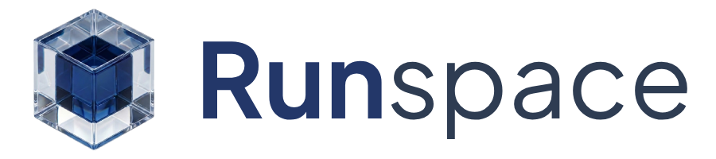

<p align="center">
  
</p>

Runspace is a desktop sandbox for running multiple programming runtimes in isolated, on-demand environments.

## Requirements

### Using Runspace

Install the release build for your platform.

Each environment you add in the playground needs its own runtime installed and configured in **Settings → Environments** (binary paths are auto-detected when possible).

| Environment | What you need |
|-------------|---------------|
| Node.js | [Node.js](https://nodejs.org/en/download) |
| PHP | [PHP](https://www.php.net/downloads) |
| Python | [Python](https://www.python.org/downloads/) |
| Ruby | [Ruby](https://www.ruby-lang.org/en/downloads/) |
| GCC (C) | GCC ([Xcode Command Line Tools](https://developer.apple.com/xcode/resources/) on macOS) |
| G++ (C++) | G++ ([Xcode Command Line Tools](https://developer.apple.com/xcode/resources/) on macOS) |
| Laravel | PHP + [Composer](https://getcomposer.org/) |
| Symfony | PHP + [Composer](https://getcomposer.org/) |
| Phalcon | PHP (with [Phalcon extension](https://docs.phalcon.io/5.9/installation/)) + [Composer](https://getcomposer.org/) |

You only install the runtimes for the environments you use. Node.js is not required to run PHP, and so on.

### Developing Runspace

To build or contribute to Runspace from source:

- Node.js 20+
- Rust stable
- Xcode Command Line Tools (macOS)
- [Composer](https://getcomposer.org/) — generates bundled Laravel/Symfony/Phalcon skeletons during build (`npm run prepare:frameworks`)

## Development

Install dependencies:

```bash
npm install
```

Run the desktop app in development mode (with hot reload):

```bash
npm run tauri dev
```

Build the production app:

```bash
npm run tauri build
```

Run tests:

```bash
npm test
```

Generate framework skeletons manually (first clone or after bumping `manifest.json`):

```bash
npm run prepare:frameworks
```

Lint:

```bash
npm run lint
```
