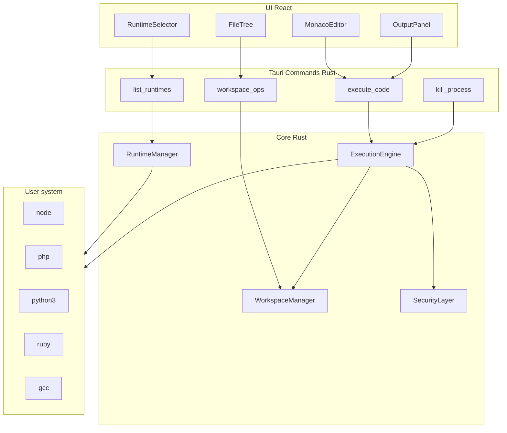
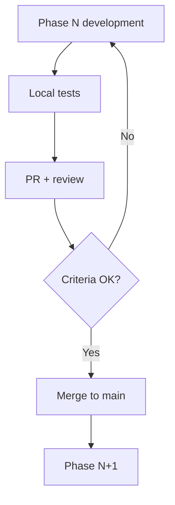

# Runspace MVP Plan

Runspace is a desktop sandbox app for running code in multiple user-installable runtimes. This directory contains the phased implementation plan.

## Stack

| Layer | Technology |
|-------|------------|
| Desktop shell | Tauri 2 |
| UI | React + TypeScript + Vite |
| Editor | Monaco Editor |
| State | Zustand |
| Tests | Vitest + Playwright (E2E) |
| Backend / processes | Rust (`src-tauri/`) |

**Core principle:** runtimes are not bundled with the installer. The user installs them on their system and Runspace detects and runs them in an isolated directory.

## Overall architecture

## Persistent data

| Resource | Location |
|----------|----------|
| Workspaces | `~/.runspace/workspaces/{uuid}/` |
| Runtime config | `~/.runspace/runtimes.json` |
| Snippets | `~/.runspace/snippets/` |
| Audit log | `~/.runspace/audit.log` |
| Settings | `~/.runspace/settings.json` |

## Phases

| Phase | Document | Estimated duration | Main deliverable |
|-------|----------|-------------------|------------------|
| 0 | [phase-0.md](phase-0.md) | 3 days | Desktop shell + CI |
| 1 | [phase-1.md](phase-1.md) | 5 days | Node.js execution in Rust |
| 2 | [phase-2.md](phase-2.md) | 5 days | Monaco + output panel |
| 3 | [phase-3.md](phase-3.md) | 5 days | Runtime Manager |
| 4 | [phase-4.md](phase-4.md) | 7 days | PHP, Python, Ruby |
| 5 | [phase-5.md](phase-5.md) | 5 days | Multi-file workspace |
| 6 | [phase-6.md](phase-6.md) | 5 days | Hardened security |
| 7 | [phase-7.md](phase-7.md) | 4 days | C/C++ |
| 8 | [phase-8.md](phase-8.md) | 5 days | Release v0.1.0 |

**Total estimated:** 6–8 weeks part-time.

## MVP scope vs post-MVP

### In MVP (v0.1.0)

- Functional desktop shell (macOS first)
- Monaco editor with syntax highlighting
- Sandbox execution: Node.js, PHP, Python, Ruby, C, C++
- Runtime detection on PATH
- Basic file tree and persistent workspace
- Reinforced minimum security
- Local snippets and Welcome screen

### Out of MVP

- Automatic runtime installers (nvm, pyenv, phpenv)
- Laravel / Symfony (composer, server, `.env`)
- Integrated debugger
- Interactive REPL
- Plugins and extensions
- Containers / cgroups
- Cloud sync

## Phase completion checklists

Each phase document (`phase-0.md` … `phase-8.md`) ends with a **Phase completion checklist**: the full list of implementation, verification, test, and PR items required before that phase can be marked done. Use it as the single gate for closing a phase PR.

## Per-phase review flow

Each phase PR must include:

1. Acceptance criteria checked in the description
2. Screenshot or GIF of the main flow
3. Tests passing in CI
4. Explicit "Out of scope" section
5. Entry in `CHANGELOG.md`

## Recorded technical decisions

| Decision | MVP value | Revisit in |
|----------|-----------|------------|
| Desktop shell | Tauri 2 | — |
| stdout streaming | Tauri events (`emit`) | Phase 1 |
| Snippet persistence | JSON in `~/.runspace/` | Phase 2 |
| Primary platform | macOS | Phase 0 |
| Network in sandbox | Off by default | Phase 6 |
| Laravel/Symfony | Post-MVP | v0.2+ |
