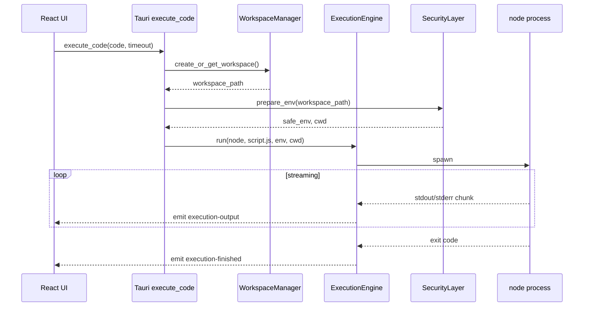

# Phase 1 — Node.js execution (backend)

**Estimated duration:** 5 days  
**Dependencies:** Phase 0 completed  
**Suggested PR:** `feat/phase-1-node-execution`

---

## Goal

Execute JavaScript code with Node.js from the Tauri Rust backend, capturing stdout/stderr via streaming, with timeout and process stop capability. The UI will be minimal (textarea + buttons); the focus is the execution engine and directory sandbox.

---

## What this phase covers

1. `WorkspaceManager`: sandbox directory creation and management
2. `ExecutionEngine`: process spawn, streaming, timeout, kill
3. Basic `SecurityLayer`: isolated cwd, sanitized env vars
4. Tauri commands: `execute_code`, `kill_process`
5. Minimal UI to validate the end-to-end flow
6. Rust unit tests

---

## Architecture for this phase



---

## How to implement

### 1. WorkspaceManager (Rust)

**Location:** `src-tauri/src/workspace/manager.rs`

**Responsibilities:**

- Create base directory `~/.runspace/` if it does not exist
- Create workspace per session: `~/.runspace/workspaces/{uuid}/`
- Write source code to a temp file (`main.js`)
- Return the absolute workspace path

**Internal API:**

```rust
pub struct WorkspaceManager {
    base_dir: PathBuf,
}

impl WorkspaceManager {
    pub fn new() -> Result<Self, WorkspaceError>;
    pub fn create_workspace(&self) -> Result<Workspace, WorkspaceError>;
    pub fn write_file(&self, workspace: &Workspace, filename: &str, content: &str) -> Result<PathBuf, WorkspaceError>;
    pub fn cleanup_workspace(&self, workspace: &Workspace) -> Result<(), WorkspaceError>;
}

pub struct Workspace {
    pub id: String,
    pub path: PathBuf,
}
```

**Behavior:**

- One active workspace per app session (MVP simplification)
- Default entry file is `main.js`
- Do not delete workspace on app close in this phase (useful for debug); manual cleanup or later phases

### 2. Basic SecurityLayer (Rust)

**Location:** `src-tauri/src/security/layer.rs`

**Apply in this phase:**

| Rule | Implementation |
|------|----------------|
| Restricted cwd | `Command::current_dir(workspace_path)` |
| Minimal env | Only `PATH`, `HOME` (or empty), `LANG`; exclude `AWS_*`, `GITHUB_TOKEN`, etc. |
| No shell args | Use `Command::new(binary)` with explicit args, never `sh -c` |
| Script path | Always inside the workspace |

**Env prefix blocklist:**

```
AWS_, GITHUB_, GITLAB_, NPM_TOKEN, DOCKER_, SSH_, CI_, TAURI_
```

**API:**

```rust
pub fn sanitize_env() -> HashMap<String, String>;
pub fn validate_path_in_workspace(workspace: &Path, file: &Path) -> Result<(), SecurityError>;
```

### 3. ExecutionEngine (Rust)

**Location:** `src-tauri/src/engine/executor.rs`

**Responsibilities:**

- Spawn child process
- Async read of stdout/stderr on separate threads
- Emit Tauri events in real time
- Timeout with `tokio::time::timeout` or thread with `kill`
- Register PID for `kill_process`

**API:**

```rust
pub struct ExecutionEngine {
    active_process: Arc<Mutex<Option<Child>>>,
}

pub struct ExecutionRequest {
    pub binary: PathBuf,       // path to `node`
    pub script_path: PathBuf,
    pub cwd: PathBuf,
    pub env: HashMap<String, String>,
    pub timeout_secs: u64,     // default: 30
}

pub struct ExecutionResult {
    pub exit_code: Option<i32>,
    pub timed_out: bool,
    pub stdout: String,        // accumulated (backup if events are lost)
    pub stderr: String,
}

impl ExecutionEngine {
    pub fn run(&self, app: AppHandle, request: ExecutionRequest) -> Result<ExecutionResult, ExecutionError>;
    pub fn kill(&self) -> Result<(), ExecutionError>;
}
```

**Tauri events emitted:**

| Event | Payload |
|-------|---------|
| `execution-output` | `{ stream: "stdout" \| "stderr", chunk: string }` |
| `execution-finished` | `{ exit_code: number \| null, timed_out: boolean }` |
| `execution-started` | `{ pid: number }` |

**Streaming implementation:**

```rust
// Pseudocode
let stdout = child.stdout.take().unwrap();
let stderr = child.stderr.take().unwrap();

std::thread::spawn(move || {
    let reader = BufReader::new(stdout);
    for line in reader.lines() {
        app.emit("execution-output", OutputEvent { stream: "stdout", chunk: line });
    }
});
// Same for stderr on another thread
```

**Timeout:**

- If process exceeds `timeout_secs`, call `child.kill()` and set `timed_out: true`
- Emit `execution-finished` with `exit_code: null`

### 4. Tauri commands

**Location:** `src-tauri/src/commands/execution.rs`

```rust
#[tauri::command]
pub async fn execute_code(
    app: AppHandle,
    state: State<'_, AppState>,
    code: String,
    timeout_secs: Option<u64>,
) -> Result<(), String>;

#[tauri::command]
pub async fn kill_process(
    state: State<'_, AppState>,
) -> Result<(), String>;
```

**`execute_code` flow:**

1. If active process exists, reject or kill previous (decide: auto-kill)
2. Create/get workspace
3. Write `code` to `main.js`
4. Resolve `node` binary (hardcoded `which node` or `command -v node` in this phase)
5. Prepare sanitized env
6. Launch `ExecutionEngine::run` in `tauri::async_runtime::spawn`
7. Return `Ok(())` immediately; result arrives via events

**AppState:**

```rust
pub struct AppState {
    pub workspace_manager: Mutex<WorkspaceManager>,
    pub execution_engine: ExecutionEngine,
}
```

### 5. Tauri permissions

Extend `capabilities/default.json`:

```json
{
  "permissions": [
    "core:default",
    "shell:allow-spawn",
    "shell:allow-kill"
  ]
}
```

Register shell plugin scope to allow only `node` (Tauri 2 shell scope).

### 6. Minimal UI (React)

**Location:** replace placeholders in `EditorArea` and `OutputPanel`

**Components:**

| Component | Description |
|-----------|-------------|
| `CodeTextarea` | `<textarea>` with default JS: `console.log("Hello, Runspace!");` |
| `RunButton` | Calls `invoke("execute_code", { code, timeoutSecs: 30 })` |
| `StopButton` | Calls `invoke("kill_process")`; disabled when not running |
| `OutputView` | `<pre>` listening to `execution-output` and concatenating chunks |

**Hook `useExecution`:**

```typescript
// src/hooks/useExecution.ts
export function useExecution() {
  const [stdout, setStdout] = useState("");
  const [stderr, setStderr] = useState("");
  const [status, setStatus] = useState<"idle" | "running" | "done">("idle");
  const [exitCode, setExitCode] = useState<number | null>(null);

  // listen: execution-output, execution-finished, execution-started
  // run(code), stop()
}
```

**Shared types:** `src/core/types/execution.ts`

```typescript
export type ExecutionStream = "stdout" | "stderr";

export interface ExecutionOutputEvent {
  stream: ExecutionStream;
  chunk: string;
}

export interface ExecutionFinishedEvent {
  exit_code: number | null;
  timed_out: boolean;
}
```

### 7. Node binary resolution (temporary)

In this phase, a simple Rust function:

```rust
fn resolve_node_binary() -> Result<PathBuf, String> {
    // which::which("node") or std::process::Command::new("which")
}
```

Refactored in Phase 3 with `RuntimeManager`.

---

## Key files to create/modify

| File | Action |
|------|--------|
| `src-tauri/src/workspace/mod.rs` | New module |
| `src-tauri/src/workspace/manager.rs` | WorkspaceManager |
| `src-tauri/src/security/mod.rs` | New module |
| `src-tauri/src/security/layer.rs` | Basic SecurityLayer |
| `src-tauri/src/engine/mod.rs` | New module |
| `src-tauri/src/engine/executor.rs` | ExecutionEngine |
| `src-tauri/src/commands/execution.rs` | Tauri commands |
| `src-tauri/src/state.rs` | AppState |
| `src/hooks/useExecution.ts` | React hook |
| `src/core/types/execution.ts` | TS types |
| `src-tauri/Cargo.toml` | Add deps: `uuid`, `which` (optional) |

---

## Phase completion checklist

Everything below must be checked before marking Phase 1 as done.

### Backend (Rust)

- [ ] `WorkspaceManager` creates `~/.runspace/workspaces/{uuid}/` and writes `main.js`
- [ ] `SecurityLayer` sanitizes env vars and validates paths inside workspace
- [ ] `ExecutionEngine` spawns Node, streams stdout/stderr, supports timeout and kill
- [ ] Tauri events emitted: `execution-started`, `execution-output`, `execution-finished`
- [ ] Commands `execute_code` and `kill_process` registered and wired to `AppState`
- [ ] Shell permissions added (`shell:allow-spawn`, `shell:allow-kill`) with Node scope
- [ ] `resolve_node_binary()` finds `node` on PATH

### Frontend (minimal UI)

- [ ] `CodeTextarea` with default snippet and Run / Stop buttons
- [ ] `OutputView` listens to execution events and displays streaming output
- [ ] `useExecution` hook (or equivalent) manages execution state
- [ ] Shared types in `src/core/types/execution.ts`

### Verification

- [ ] `console.log("hello")` shows "hello" in output in real time
- [ ] `console.error("fail")` appears on stderr (distinct or prefixed)
- [ ] Syntax error shows Node stack trace on stderr
- [ ] Stop ends `while(true){}` in under 1 second
- [ ] 30s timeout kills infinite loop and shows timeout message
- [ ] Child process cwd is inside `~/.runspace/workspaces/`
- [ ] System `AWS_ACCESS_KEY_ID` is not passed to child process

### Tests

- [ ] Rust unit: `sanitize_env` excludes blocked prefixes
- [ ] Rust unit: `validate_path_in_workspace` rejects paths outside sandbox
- [ ] Rust unit: `write_file` writes inside workspace
- [ ] Rust integration: spawn `node -e "console.log(1)"` and capture stdout

### Documentation & PR

- [ ] `CHANGELOG.md` entry added for Phase 1
- [ ] PR includes GIF of run → output → stop flow
- [ ] PR description lists what is explicitly out of scope
- [ ] CI passes (including Rust tests)

---

## Tests

| Type | What to test |
|------|--------------|
| Rust unit | `sanitize_env` excludes prefixes; `validate_path_in_workspace` rejects outside paths |
| Rust integration | Spawn `node -e "console.log(1)"` and capture stdout |
| Manual | Run snippet, stop, timeout, syntax error |
| Manual security | `require("fs").readFileSync("/etc/passwd")` — should fail or not find (depends on OS permissions) |

---

## Out of scope

- Monaco Editor (Phase 2)
- Multi-runtime (Phases 3–4)
- File tree and multiple files (Phase 5)
- Network blocking (Phase 6)
- Snippet persistence on app close
- Multiple Node version detection

---

## Risks and mitigations

| Risk | Mitigation |
|------|------------|
| Deadlock reading stdout/stderr | Separate threads; `BufReader` buffers |
| Zombie process if kill fails | `child.wait()` after kill; drop Child |
| Race on re-execution | Mutex on `active_process`; kill previous before new spawn |
| PATH without node | Clear UI error: "Node.js not found" |

---

## Phase deliverable

Functional execution engine with Node.js, directory sandbox, output streaming, and minimal UI for validation. Foundation for Monaco in Phase 2 and runtime generalization in Phase 3.
