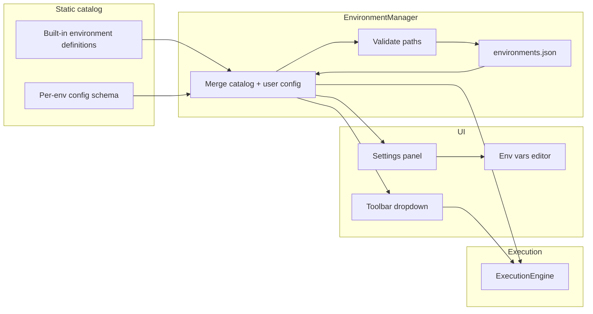

# Phase 3 — Environment Manager

**Estimated duration:** 6 days  
**Dependencies:** Phase 2 completed  
**Status:** Implemented (with deviations noted below)

### Implementation deviations from original plan

- **Installable catalog:** only environments present in code can be installed. Phase 3 ships **Node.js only**; PHP, Python, Ruby, GCC, G++, Laravel, and Symfony are added in their respective phases (not listed with `execution_ready` flags).
- **Auto-detect on startup:** binary paths are probed on app open for installed environments missing configuration (in addition to on-demand validation on Save/Test).
- **`installed_ids`:** persisted in `EnvironmentsStore`; `list_environments` returns installed only; `list_available_environments`, `install_environment`, and `uninstall_environment` commands added.

---

## Goal

Show a fixed catalog of all supported environments (runtimes and frameworks). The user chooses which one to use and configures it explicitly — binary paths and per-environment variables. Generalize `ExecutionEngine` so it no longer depends on a hardcoded binary or implicit PATH detection.

**Design principle:** Runspace does not decide what is installed. It lists every supported environment; the user configures what they need and selects what they want to run.

**Framework principle:** Framework environments (Laravel, Symfony) are **sandbox snippets**, not attachments to the user's existing projects. The user only provides a PHP binary; Runspace owns the minimal internal skeleton and bootstrap (see [Framework sandbox model](#framework-sandbox-model)).

---

## What this phase covers

1. [x] Static environment catalog (Rust + TypeScript) — Node.js only; more runtimes per phase
2. [x] Per-environment configuration schema (required paths, optional fields)
3. [x] Per-environment environment variables (`env_vars`)
4. [x] `EnvironmentManager`: load/save user config, validate paths, install/uninstall
5. [x] Refactor `execute_code` to accept `environment_id` and resolved config
6. [x] UI Settings → Environments (configure paths + env vars)
7. [x] Functional environment selector in Toolbar
8. [x] Tests for validation and config resolution

---

## Environment catalog (always visible)

The catalog is **built into the app** and always shown in the selector and settings. Nothing is hidden because it was not found on PATH.

| ID | Name | Category | Entry file | Required configuration |
|----|------|----------|------------|------------------------|
| `nodejs` | Node.js | language | `main.js` | `node_path` — path to `node` binary |
| `php` | PHP | language | `main.php` | `php_path` — path to `php` binary |
| `python` | Python | language | `main.py` | `python_path` — path to `python3` (or `python`) binary |
| `ruby` | Ruby | language | `main.rb` | `ruby_path` — path to `ruby` binary |
| `gcc` | GCC (C) | language | `main.c` | `gcc_path` — path to `gcc` binary |
| `gpp` | G++ (C++) | language | `main.cpp` | `gpp_path` — path to `g++` binary |
| `laravel` | Laravel | framework | `snippet.php` | `php_path` — PHP binary (skeleton bootstrapped internally by Runspace) |
| `symfony` | Symfony | framework | `snippet.php` | `php_path` — PHP binary (skeleton bootstrapped internally by Runspace) |

In this phase only **Node.js** must be end-to-end executable. The rest appears in the catalog with its configuration form; full execution for interpreted languages comes in Phase 4, compiled in Phase 7, and framework sandbox execution in a later release (see Phase 4 — [Framework sandbox](phase-4.md#framework-sandbox-post-phase-4)).

Each catalog entry also includes metadata used by later phases: `monaco_language`, `file_extension`, `install_guide_url`.

---

## Configuration model

### Path fields (per environment)

| Environment | Field key | Label | Type | Required |
|-------------|-----------|-------|------|----------|
| `nodejs` | `node_path` | Node.js binary | file | yes |
| `php` | `php_path` | PHP binary | file | yes |
| `python` | `python_path` | Python binary | file | yes |
| `ruby` | `ruby_path` | Ruby binary | file | yes |
| `gcc` | `gcc_path` | GCC binary | file | yes |
| `gpp` | `gpp_path` | G++ binary | file | yes |
| `laravel` | `php_path` | PHP binary | file | yes |
| `laravel` | `composer_path` | Composer binary (skeleton install/update) | file | no |
| `symfony` | `php_path` | PHP binary | file | yes |
| `symfony` | `composer_path` | Composer binary (skeleton install/update) | file | no |

### Framework sandbox model

Frameworks use the same **snippet-in-sandbox** flow as plain PHP/Python/Ruby. The user does not create or link an external Laravel/Symfony project.

| Concern | Owner |
|---------|--------|
| Code visible in Monaco | User (snippet body only) |
| Minimal app skeleton + `vendor/` | Runspace (`~/.runspace/frameworks/{laravel\|symfony}/`) |
| Bootstrap wrapper that loads the framework | Runspace (fixed script, not user-editable) |
| PHP binary | User (`php_path`) |
| First-time skeleton provisioning | Runspace (optional `composer_path` for `composer install` on internal skeleton) |

**Execution flow (later phase):**

1. Write user snippet to workspace (`snippet.php`)
2. Runspace generates a wrapper that `require`s the internal bootstrap, then inlines the snippet
3. Execute `php wrapper.php` with the user's `php_path` and framework `env_vars`

**In scope for framework snippets (later):** facades/helpers, collections, simple container/service usage, in-memory or workspace-local SQLite for basic Eloquent/Doctrine trials.

**Out of scope for framework snippets:** HTTP server (`artisan serve`, `symfony server`), routing/middleware against real requests, pointing at the user's production project tree, arbitrary `composer require` per run.

### Environment variables (per environment)

Each environment has its own `env_vars` map (`key → value`). These are injected when executing code in that environment (merged on top of the sanitized base env from Phase 6; in Phase 3, passed through directly).

Examples:

| Environment | Typical `env_vars` |
|-------------|-------------------|
| `nodejs` | `NODE_ENV=development` |
| `php` / `laravel` / `symfony` | `APP_ENV=local`, `APP_DEBUG=true` |
| `python` | `PYTHONUNBUFFERED=1` |

The UI exposes a key/value editor (add, edit, remove rows). Empty keys are rejected on save.

### Configuration status

An environment is **configured** when all required path fields are set and pass validation. It is **not configured** otherwise.

- Any environment can be **selected** in the toolbar regardless of status.
- **Run** is blocked when the selected environment is not configured, with a message pointing to Settings.
- Optional **Test** action in Settings runs the version probe on configured binaries and shows the result inline (does not auto-run on app start).

---

## Architecture



On startup, **auto-detect** fills missing binary paths for installed environments (PATH + common locations). **On-demand validation** also runs when the user saves a path or clicks Test.

---

## How to implement

### 1. Data model

**Rust:** `src-tauri/src/environment/types.rs`

```rust
#[derive(Debug, Clone, Serialize, Deserialize)]
pub enum EnvironmentCategory {
    Language,
    Framework,
}

#[derive(Debug, Clone, Serialize, Deserialize)]
pub enum ConfigFieldType {
    FilePath,
    DirectoryPath,
    Text,
}

#[derive(Debug, Clone, Serialize, Deserialize)]
pub struct ConfigField {
    pub key: String,
    pub label: String,
    pub field_type: ConfigFieldType,
    pub required: bool,
}

#[derive(Debug, Clone, Serialize, Deserialize)]
pub struct EnvironmentDefinition {
    pub id: String,
    pub name: String,
    pub category: EnvironmentCategory,
    pub file_extension: String,
    pub monaco_language: String,
    pub install_guide_url: String,
    pub config_fields: Vec<ConfigField>,
}

#[derive(Debug, Clone, Serialize, Deserialize)]
pub struct EnvironmentUserConfig {
    pub paths: HashMap<String, String>,
    pub env_vars: HashMap<String, String>,
}

#[derive(Debug, Clone, Serialize, Deserialize)]
pub struct Environment {
    pub definition: EnvironmentDefinition,
    pub user_config: EnvironmentUserConfig,
    pub configured: bool,
    pub version: Option<String>,
}

#[derive(Debug, Serialize, Deserialize)]
pub struct EnvironmentsStore {
    pub selected_environment_id: String,
    pub configs: HashMap<String, EnvironmentUserConfig>,
}
```

**TypeScript:** `src/core/types/environment.ts` (mirror of Rust model)

**Static catalog:** `src-tauri/src/environment/catalog.rs` and `src/core/constants/environmentCatalog.ts` (same IDs and schema; Rust is source of truth for execution).

### 2. EnvironmentManager

**Location:** `src-tauri/src/environment/manager.rs`

**API:**

```rust
impl EnvironmentManager {
    pub fn new(config_path: PathBuf) -> Result<Self, EnvironmentError>;
    pub fn list_all(&self) -> Vec<Environment>;
    pub fn get_environment(&self, id: &str) -> Option<Environment>;
    pub fn get_selected(&self) -> Option<Environment>;
    pub fn set_selected(&mut self, id: &str) -> Result<(), EnvironmentError>;
    pub fn set_paths(&mut self, id: &str, paths: HashMap<String, String>) -> Result<(), EnvironmentError>;
    pub fn set_env_vars(&mut self, id: &str, env_vars: HashMap<String, String>) -> Result<(), EnvironmentError>;
    pub fn validate_environment(&mut self, id: &str) -> Result<ValidationResult, EnvironmentError>;
    pub fn resolve_for_execution(&self, id: &str) -> Result<ResolvedEnvironment, EnvironmentError>;
    pub fn save(&self) -> Result<(), EnvironmentError>;
    pub fn load(&mut self) -> Result<(), EnvironmentError>;
}
```

**Startup flow:** `load()` → merge persisted `configs` with static catalog → compute `configured` flag per environment → done. No PATH probe unless the user triggers Test.

**Path validation** (on save or Test):

1. File paths: exists, is a file, executable (Unix permissions)
2. Directory paths: exists, is a directory
3. For binary fields: run `--version` (or environment-specific probe) and parse first line into `version`

**Persistence:** `~/.runspace/environments.json`

```json
{
  "selected_environment_id": "nodejs",
  "configs": {
    "nodejs": {
      "paths": {
        "node_path": "/Users/me/.nvm/versions/node/v20.11.0/bin/node"
      },
      "env_vars": {
        "NODE_ENV": "development"
      }
    },
    "laravel": {
      "paths": {
        "php_path": "/opt/homebrew/bin/php",
        "composer_path": "/opt/homebrew/bin/composer"
      },
      "env_vars": {
        "APP_ENV": "local"
      }
    }
  }
}
```

Only user-provided data is persisted. The catalog never changes at runtime.

### 3. Tauri commands

**Location:** `src-tauri/src/commands/environment.rs`

```rust
#[tauri::command]
fn list_environments(state: State<AppState>) -> Result<Vec<Environment>, String>;

#[tauri::command]
fn get_selected_environment(state: State<AppState>) -> Result<Environment, String>;

#[tauri::command]
fn set_selected_environment(state: State<AppState>, environment_id: String) -> Result<(), String>;

#[tauri::command]
fn set_environment_paths(
    state: State<AppState>,
    environment_id: String,
    paths: HashMap<String, String>,
) -> Result<(), String>;

#[tauri::command]
fn set_environment_env_vars(
    state: State<AppState>,
    environment_id: String,
    env_vars: HashMap<String, String>,
) -> Result<(), String>;

#[tauri::command]
fn validate_environment(state: State<AppState>, environment_id: String) -> Result<ValidationResult, String>;
```

### 4. ExecutionEngine refactor

**Changes to `execute_code`:**

```rust
pub async fn execute_code(
    app: AppHandle,
    state: State<AppState>,
    code: String,
    environment_id: Option<String>,
    timeout_secs: Option<u64>,
) -> Result<(), String>
```

**Flow:**

1. Resolve `environment_id` → `ResolvedEnvironment` from `EnvironmentManager`
2. If not `configured` → error: "Environment not configured. Open Settings → Environments."
3. Read primary binary from resolved paths (e.g. `node_path` for `nodejs`)
4. Build execution env: base env + `user_config.env_vars` for that environment
5. Determine entry file (`main.js`, `main.php`, etc.)
6. Write code and execute with corresponding adapter (only Node.js functional in this phase)

`ResolvedEnvironment` carries: `id`, `binary_path`, `env_vars`, `extra_paths` (e.g. internal framework skeleton root for Laravel/Symfony adapters), `file_extension`.

### 5. UI — Toolbar selector

**Location:** `src/components/environment/EnvironmentSelector.tsx`

**Behavior:**

- Dropdown lists **all** catalog environments, grouped by category (Languages / Frameworks)
- Each item shows name + status badge: `Configured` / `Not configured`
- Selecting any environment calls `set_selected_environment` and updates the store
- If not configured: Run button disabled with tooltip "Configure in Settings"
- No item is hidden or disabled in the list itself

**Store:** `src/stores/environmentStore.ts`

```typescript
interface EnvironmentStore {
  environments: Environment[];
  selectedId: string;
  load: () => Promise<void>;
  select: (id: string) => Promise<void>;
}
```

### 6. UI — Settings → Environments

**Location:** `src/components/settings/EnvironmentsSettings.tsx`

**View (expandable cards per environment):**

```
Environments
─────────────────────────────────────────────────────────────
▼ Node.js                                    [Configured ✓]
    Node.js binary    [/usr/local/bin/node        ] [Browse]
    Version           v20.11.0 (last tested)
    Environment variables
    ┌──────────────┬─────────────────┬───┐
    │ NODE_ENV     │ development     │ × │
    └──────────────┴─────────────────┴───┘
    [+ Add variable]                    [Test] [Save]

▶ PHP                                        [Not configured]
▶ Python                                     [Not configured]
▶ Ruby                                       [Not configured]
▶ GCC (C)                                    [Not configured]
▶ G++ (C++)                                  [Not configured]
▶ Laravel                                    [Not configured]
    (requires PHP binary; sandbox skeleton managed by Runspace)
▶ Symfony                                    [Not configured]
    (requires PHP binary; sandbox skeleton managed by Runspace)
```

**Actions per environment:**

- **Browse:** native file/directory dialog (`tauri-plugin-dialog`) per field type
- **Save:** validate paths server-side, persist config
- **Test:** run `validate_environment`, show version or error inline
- **Install guide:** link to `install_guide_url` for environments that need external installs
- **Env vars:** inline key/value table with add/remove; saved with the rest of the config

**Settings navigation:** gear icon in Toolbar → modal panel or side view.

### 7. Env vars editor

**Location:** `src/components/settings/EnvVarsEditor.tsx`

Reusable component: list of `{ key, value }` rows, add/remove, trim keys, reject duplicates and empty keys on save. Used inside each environment card in `EnvironmentsSettings`.

---

## Key files to create/modify

| File | Action |
|------|--------|
| `src-tauri/src/environment/mod.rs` | Module | Done |
| `src-tauri/src/environment/catalog.rs` | Static catalog (Node.js only in Phase 3) | Done |
| `src-tauri/src/environment/detect.rs` | Binary auto-detection | Done |
| `src-tauri/src/environment/manager.rs` | EnvironmentManager | Done |
| `src-tauri/src/environment/types.rs` | Types | Done |
| `src-tauri/src/commands/environment.rs` | Commands | Done |
| `src/core/types/environment.ts` | TS types | Done |
| `src/core/constants/environmentCatalog.ts` | Catalog mirror | Done |
| `src/stores/environmentStore.ts` | Store | Done |
| `src/components/environment/EnvironmentSelector.tsx` | Dropdown | Done |
| `src/components/settings/EnvironmentsSettings.tsx` | Settings panel | Done |
| `src/components/settings/SettingsPanel.tsx` | Settings shell | Done |
| `src/components/settings/EnvVarsEditor.tsx` | Env vars UI | Done |
| `src-tauri/src/commands/execution.rs` | Refactor `environment_id` + env injection | Done |

---

## Phase completion checklist

Everything below must be checked before marking Phase 3 as done.

### Backend (Rust)

- [x] `EnvironmentDefinition`, `EnvironmentUserConfig`, `EnvironmentsStore` types defined (`installed_ids` added)
- [x] Per-environment config schema (required path fields) defined in catalog
- [x] `EnvironmentManager` loads/saves `~/.runspace/environments.json`
- [x] Path validation on save (exists, file/dir type, executable for binaries)
- [x] On-demand version probe via `validate_environment`
- [x] Startup auto-detect for missing binary paths (`detect.rs`)
- [x] `env_vars` persisted and returned in `resolve_for_execution`
- [x] Tauri commands: `list_environments`, `get_selected_environment`, `set_selected_environment`, `set_environment_paths`, `set_environment_env_vars`, `validate_environment`
- [x] Tauri commands: `list_available_environments`, `install_environment`, `uninstall_environment`
- [x] `execute_code` refactored to accept `environment_id`, use resolved paths and env vars (Node.js end-to-end only)

### Frontend

- [x] `EnvironmentSelector` in Toolbar lists installed environments with configured/not configured badge
- [x] `EnvironmentsSettings` panel with path pickers, env vars editor, Test, Save; Installed / Available sections
- [x] `environmentStore` loads and persists selected environment; install/uninstall actions
- [x] Settings accessible from Toolbar gear icon
- [x] Run disabled with clear message when selected environment is not configured
- [x] File dialog and URL opener plugins configured

### Verification

- [x] Unconfigured environments selectable but Run blocked
- [x] Configuring Node.js path + saving enables Run for Node.js
- [x] Custom path (e.g. nvm node) works after manual configuration
- [x] Env vars saved for an environment appear in resolved config
- [x] `validate_environment` shows version after Test
- [x] Environment selection and config persist in `environments.json`
- [x] Node.js execution works without regression after refactor

### Tests

- [x] Rust unit: version parsing for Node
- [x] Rust unit: `configured` flag from partial/complete path sets
- [x] Rust unit: env_vars merge in `resolve_for_execution`
- [x] Rust unit: validation rejects missing file, non-executable binary
- [x] TS unit: `environmentStore`, `EnvVarsEditor`, `AppShell` layout

### Documentation & PR

- [x] `CHANGELOG.md` entry added for Phase 3
- [x] CI passes

---

## Tests

| Type | What to test |
|------|--------------|
| Rust unit | Node, PHP, Python version parsing |
| Rust unit | `configured` computed from required fields |
| Rust unit | `env_vars` included in resolved execution config |
| Rust unit | Path validation errors (missing, not executable) |
| Manual | Configure Node via Browse; Test shows version; Run works |
| Manual | Select unconfigured PHP; Run blocked; configure path; Run enabled in Phase 4 |
| Manual | Add `NODE_ENV` env var; verify it reaches child process (log or `console.log(process.env.NODE_ENV)`) |

---

## Out of scope

- Full 8-environment catalog in Phase 3 (added incrementally per phase)
- Automatic PATH detection or hiding environments based on what is installed (startup auto-detect fills paths only; does not hide environments)
- PHP/Python/Ruby execution (Phase 4)
- GCC/G++ execution (Phase 7)
- Framework sandbox execution (internal bootstrap + snippet wrapper; see Phase 4)
- Automatic runtime installation
- Multiple profiles per environment (e.g. two Node versions side by side)
- Global env vars shared across all environments (only per-environment in this phase)
- `.env` file import for framework skeletons (manual key/value editor only; defaults ship with internal skeleton)

---

## Risks and mitigations

| Risk | Mitigation |
|------|------------|
| User does not know where binaries live | Install guide links; Browse dialog; Test feedback |
| Inconsistent version strings | Tolerant parser; show raw first line on failure |
| Framework envs shown before execution exists | Clear "configuration only" badge; Run blocked until framework sandbox phase |
| Env vars with sensitive values in plain JSON | Document local-only storage; encryption post-MVP |
| Empty env var keys saved by mistake | Client + server validation on save |

---

## Phase deliverable

Environment management decoupled from the execution engine: installable runtimes, user-driven configuration (paths + env vars), startup auto-detect, and validation on demand. Node.js end-to-end. Foundation for multi-runtime execution in Phase 4 and framework sandbox snippets in a later release.
