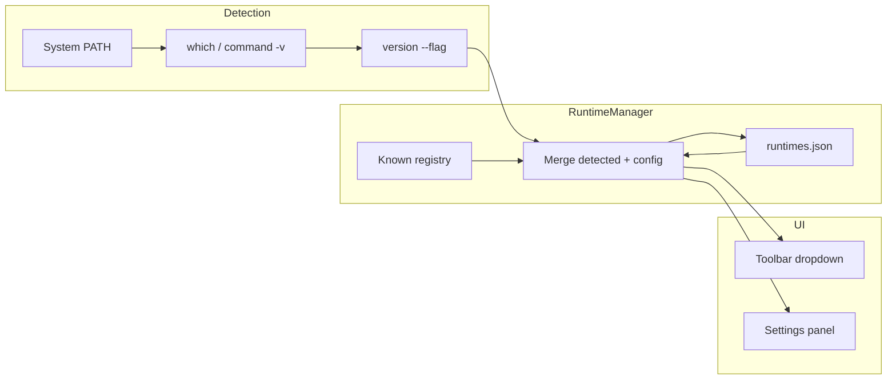

# Phase 3 — Runtime Manager

**Estimated duration:** 5 days  
**Dependencies:** Phase 2 completed  
**Suggested PR:** `feat/phase-3-runtime-manager`

---

## Goal

Automatically detect runtimes installed on the user's system, allow selecting which one to use for execution, configure custom paths, and show installation guides for missing ones. Generalize `ExecutionEngine` so it no longer depends on a hardcoded binary.

---

## What this phase covers

1. `Runtime` data model (Rust + TypeScript)
2. `RuntimeManager`: PATH detection, versions, persistence
3. Refactor `execute_code` to accept `runtime_id`
4. UI Settings → Runtimes
5. Functional runtime selector in Toolbar
6. Tests with controlled PATH

---

## Runtimes to detect (MVP)

| ID | Name | Binary | Version command | Install guide |
|----|------|--------|-----------------|---------------|
| `nodejs` | Node.js | `node` | `node --version` | https://nodejs.org |
| `php` | PHP | `php` | `php --version` | https://php.net/downloads |
| `python` | Python | `python3` | `python3 --version` | https://python.org |
| `ruby` | Ruby | `ruby` | `ruby --version` | https://ruby-lang.org |
| `gcc` | GCC (C) | `gcc` | `gcc --version` | https://gcc.gnu.org |
| `gpp` | G++ (C++) | `g++` | `g++ --version` | https://gcc.gnu.org |

In this phase only **Node.js** must be end-to-end executable; the rest is detected and shown in UI but full execution comes in Phase 4 (interpreted) and Phase 7 (compiled).

---

## Architecture



---

## How to implement

### 1. Data model

**Rust:** `src-tauri/src/runtime/types.rs`

```rust
#[derive(Debug, Clone, Serialize, Deserialize)]
pub struct Runtime {
    pub id: String,
    pub name: String,
    pub binary_name: String,
    pub binary_path: Option<String>,
    pub version: Option<String>,
    pub detected: bool,
    pub install_guide_url: String,
    pub file_extension: String,
    pub enabled: bool,
}

#[derive(Debug, Serialize, Deserialize)]
pub struct RuntimesConfig {
    pub selected_runtime_id: String,
    pub runtimes: Vec<Runtime>,
    pub custom_paths: HashMap<String, String>, // runtime_id -> absolute path
}
```

**TypeScript:** `src/core/types/runtime.ts` (mirror of Rust model)

### 2. RuntimeManager

**Location:** `src-tauri/src/runtime/manager.rs`

**API:**

```rust
impl RuntimeManager {
    pub fn new(config_path: PathBuf) -> Result<Self, RuntimeError>;
    pub fn detect_all(&mut self) -> Vec<Runtime>;
    pub fn get_runtime(&self, id: &str) -> Option<&Runtime>;
    pub fn get_selected(&self) -> Option<&Runtime>;
    pub fn set_selected(&mut self, id: &str) -> Result<(), RuntimeError>;
    pub fn set_custom_path(&mut self, id: &str, path: PathBuf) -> Result<(), RuntimeError>;
    pub fn save(&self) -> Result<(), RuntimeError>;
    pub fn load(&mut self) -> Result<(), RuntimeError>;
}
```

**Binary detection:**

```rust
fn detect_binary(name: &str) -> Option<PathBuf> {
    which::which(name).ok()
    // Alternative: Command::new("which").arg(name)
}
```

**Multiple version detection:**

```bash
which -a node   # macOS/Linux
```

For MVP: use the first found; show full path in UI. Multiple version selector = post-MVP.

**Get version:**

```rust
fn get_version(binary: &Path, version_flag: &str) -> Option<String> {
    let output = Command::new(binary).arg(version_flag).output().ok()?;
    let stdout = String::from_utf8_lossy(&output.stdout);
    // Parse first line: "v20.11.0" or "PHP 8.3.0 ..."
}
```

**Persistence:** `~/.runspace/runtimes.json`

```json
{
  "selected_runtime_id": "nodejs",
  "custom_paths": {},
  "runtimes": []
}
```

On app start: `load()` → `detect_all()` → merge (detected update `binary_path` and `version`; custom_paths override) → `save()`.

### 3. Tauri commands

**Location:** `src-tauri/src/commands/runtime.rs`

```rust
#[tauri::command]
fn list_runtimes(state: State<AppState>) -> Result<Vec<Runtime>, String>;

#[tauri::command]
fn get_selected_runtime(state: State<AppState>) -> Result<Runtime, String>;

#[tauri::command]
fn set_selected_runtime(state: State<AppState>, runtime_id: String) -> Result<(), String>;

#[tauri::command]
fn set_runtime_path(state: State<AppState>, runtime_id: String, path: String) -> Result<(), String>;

#[tauri::command]
fn refresh_runtimes(state: State<AppState>) -> Result<Vec<Runtime>, String>;
```

### 4. ExecutionEngine refactor

**Changes to `execute_code`:**

```rust
pub async fn execute_code(
    app: AppHandle,
    state: State<AppState>,
    code: String,
    runtime_id: Option<String>,  // default: selected
    timeout_secs: Option<u64>,
) -> Result<(), String>
```

**Flow:**

1. Resolve `runtime_id` → `Runtime` from `RuntimeManager`
2. If `!runtime.detected` → error: "Runtime not installed"
3. Get `binary_path` (custom or detected)
4. Determine file extension (`main.js`, `main.php`, etc.)
5. Write code and execute with corresponding adapter (only Node functional in this phase)

**Entry file by runtime:**

| runtime_id | Entry file |
|------------|------------|
| nodejs | `main.js` |
| php | `main.php` |
| python | `main.py` |
| ruby | `main.rb` |
| gcc | `main.c` |
| gpp | `main.cpp` |

### 5. UI — Toolbar selector

**Location:** `src/components/runtime/RuntimeSelector.tsx`

**Behavior:**

- Dropdown with detected runtimes (enabled) and undetected (disabled + warning icon)
- On selecting detected runtime: `set_selected_runtime` + update store
- On selecting undetected: modal with `install_guide_url` link and "Set custom path" option

**Store:** `src/stores/runtimeStore.ts`

```typescript
interface RuntimeStore {
  runtimes: Runtime[];
  selectedId: string;
  load: () => Promise<void>;
  select: (id: string) => Promise<void>;
  refresh: () => Promise<void>;
}
```

### 6. UI — Settings → Runtimes

**Location:** `src/components/settings/RuntimesSettings.tsx`

**View:**

```
Runtimes
─────────────────────────────────────────
[✓] Node.js     v20.11.0    /usr/local/bin/node    [Change path]
[✗] PHP         Not found   [Install guide]        [Set path]
[✓] Python      3.12.0      /usr/bin/python3       [Change path]
...
                                              [Refresh all]
```

**Actions:**

- **Install guide:** open URL in browser (`tauri-plugin-opener` or `shell:allow-open`)
- **Set path / Change path:** native file dialog (`tauri-plugin-dialog`)
- **Refresh all:** re-run detection

**Settings navigation:** gear icon in Toolbar → modal panel or side view.

### 7. Custom path validation

When saving a manual path:

1. Verify file exists
2. Verify it is executable (`fs::metadata` + Unix permissions)
3. Run `--version` and parse
4. Save in `custom_paths`

---

## Key files to create/modify

| File | Action |
|------|--------|
| `src-tauri/src/runtime/mod.rs` | Module |
| `src-tauri/src/runtime/manager.rs` | RuntimeManager |
| `src-tauri/src/runtime/types.rs` | Types |
| `src-tauri/src/commands/runtime.rs` | Commands |
| `src/core/types/runtime.ts` | TS types |
| `src/stores/runtimeStore.ts` | Store |
| `src/components/runtime/RuntimeSelector.tsx` | Dropdown |
| `src/components/settings/RuntimesSettings.tsx` | Settings panel |
| `src-tauri/src/commands/execution.rs` | Refactor runtime_id |

---

## Phase completion checklist

Everything below must be checked before marking Phase 3 as done.

### Backend (Rust)

- [ ] `Runtime` and `RuntimesConfig` types defined
- [ ] `RuntimeManager` detects binaries on PATH and reads versions
- [ ] All 6 MVP runtimes registered (nodejs, php, python, ruby, gcc, gpp)
- [ ] Config persisted to `~/.runspace/runtimes.json` (load → detect → merge → save)
- [ ] Custom path override with validation (exists, executable, `--version`)
- [ ] Tauri commands: `list_runtimes`, `get_selected_runtime`, `set_selected_runtime`, `set_runtime_path`, `refresh_runtimes`
- [ ] `execute_code` refactored to accept `runtime_id` (Node.js end-to-end only)

### Frontend

- [ ] `RuntimeSelector` dropdown in Toolbar (enabled/disabled + warning states)
- [ ] `RuntimesSettings` panel with install guide links, path picker, refresh
- [ ] `runtimeStore` loads and persists selected runtime
- [ ] Settings accessible from Toolbar gear icon
- [ ] File dialog and URL opener plugins configured

### Verification

- [ ] On app open, Node.js detected on PATH with version shown
- [ ] Missing runtimes show "Not installed" badge
- [ ] "Install guide" opens URL in browser
- [ ] Custom path to valid binary works (e.g. nvm node)
- [ ] Runtime selection persists in `runtimes.json`
- [ ] Node.js execution works without regression after refactor
- [ ] Run blocked/disabled with clear error when runtime not installed
- [ ] `refresh_runtimes` updates list without restart

### Tests

- [ ] Rust unit: version parsing for Node, PHP, Python
- [ ] Rust unit: merge detected runtimes + custom_paths
- [ ] Rust integration: detection with temporary PATH

### Documentation & PR

- [ ] `CHANGELOG.md` entry added for Phase 3
- [ ] PR includes screenshot of Settings → Runtimes
- [ ] PR description lists what is explicitly out of scope
- [ ] CI passes

---

## Tests

| Type | What to test |
|------|--------------|
| Rust unit | Node, PHP, Python version parsing |
| Rust unit | Merge detected + custom_paths |
| Rust integration | Temporary PATH with fake binary |
| Manual | Simulate node removed from PATH; check UI |
| Manual | Custom path to alternate node (nvm) |

---

## Out of scope

- PHP/Python/Ruby execution (Phase 4)
- Automatic runtime installation
- Multiple version selector for same runtime
- Laravel/Symfony as runtimes
- Detecting runtimes in non-standard paths without user action

---

## Risks and mitigations

| Risk | Mitigation |
|------|------------|
| `python` vs `python3` across OS | Try `python3` first; fallback `python` |
| Inconsistent version strings | Tolerant parser; show raw first line on failure |
| nvm/fnm use shims | Allow custom path; document in README |
| Race refreshing during execution | Disable refresh if status === running |

---

## Phase deliverable

Runtime management system decoupled from the execution engine, with UI to inspect and configure environments. Foundation for multi-runtime in Phase 4.
