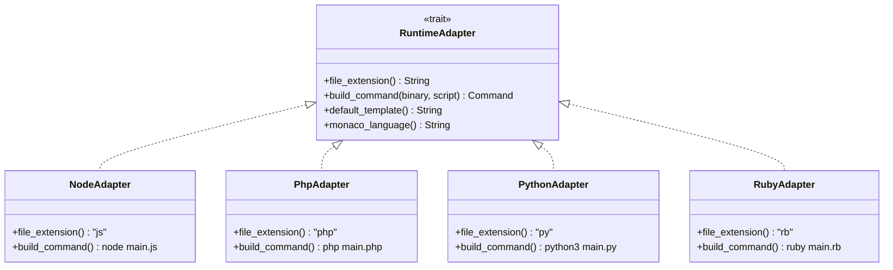

# Phase 4 — Multi-runtime (PHP, Python, Ruby)

**Estimated duration:** 7 days  
**Dependencies:** Phase 3 completed (RuntimeManager + selector)  
**Suggested PR:** `feat/phase-4-multi-runtime`

---

## Goal

Execute code in PHP, Python, and Ruby with the same flow as Node.js: select runtime, write code, Run, see output. Adapt Monaco to the active language and provide initial templates per runtime.

---

## What this phase covers

1. Adapter pattern in `ExecutionEngine`
2. Execution commands per interpreted runtime
3. Dynamic Monaco language mode switching
4. Hello-world templates per language
5. Runtime-specific error handling
6. Integration tests (conditional on PATH)

---

## Adapter pattern



---

## How to implement

### 1. RuntimeAdapter trait (Rust)

**Location:** `src-tauri/src/engine/adapters/mod.rs`

```rust
pub trait RuntimeAdapter: Send + Sync {
    fn runtime_id(&self) -> &str;
    fn file_extension(&self) -> &str;
    fn entry_filename(&self) -> String {
        format!("main.{}", self.file_extension())
    }
    fn build_command(&self, binary: &Path, script: &Path) -> Command;
    fn default_template(&self) -> &str;
}

pub fn get_adapter(runtime_id: &str) -> Result<Box<dyn RuntimeAdapter>, AdapterError> {
    match runtime_id {
        "nodejs" => Ok(Box::new(NodeAdapter)),
        "php" => Ok(Box::new(PhpAdapter)),
        "python" => Ok(Box::new(PythonAdapter)),
        "ruby" => Ok(Box::new(RubyAdapter)),
        _ => Err(AdapterError::Unsupported(runtime_id.to_string())),
    }
}
```

### 2. Concrete adapters

**NodeAdapter** (`adapters/node.rs`):

```rust
fn build_command(&self, binary: &Path, script: &Path) -> Command {
    let mut cmd = Command::new(binary);
    cmd.arg(script);
    cmd
}

fn default_template(&self) -> &str {
    "console.log('Hello from Node.js!');\n"
}
```

**PhpAdapter** (`adapters/php.rs`):

```rust
fn build_command(&self, binary: &Path, script: &Path) -> Command {
    let mut cmd = Command::new(binary);
    cmd.arg(script);
    cmd
}

fn default_template(&self) -> &str {
    "<?php\necho \"Hello from PHP!\";\n"
}
```

**PythonAdapter** (`adapters/python.rs`):

```rust
fn default_template(&self) -> &str {
    "print('Hello from Python!')\n"
}
```

**RubyAdapter** (`adapters/ruby.rs`):

```rust
fn default_template(&self) -> &str {
    "puts 'Hello from Ruby!'\n"
}
```

### 3. ExecutionEngine refactor

**Before:** hardcoded Node logic  
**After:**

```rust
pub fn run_with_adapter(
    &self,
    app: AppHandle,
    adapter: &dyn RuntimeAdapter,
    binary: &Path,
    script_content: &str,
    workspace: &Workspace,
    env: HashMap<String, String>,
    timeout_secs: u64,
) -> Result<ExecutionResult, ExecutionError> {
    let filename = adapter.entry_filename();
    let script_path = workspace_manager.write_file(workspace, &filename, script_content)?;
    let mut cmd = adapter.build_command(binary, &script_path);
    cmd.current_dir(&workspace.path).envs(&env);
    // spawn + stream (same as Phase 1)
}
```

### 4. Monaco — language modes

**Runtime → Monaco language mapping:**

| runtime_id | Monaco `language` |
|------------|-------------------|
| nodejs | `javascript` |
| php | `php` |
| python | `python` |
| ruby | `ruby` |

**Location:** `src/core/constants/runtimeLanguages.ts`

```typescript
export const RUNTIME_LANGUAGES: Record<string, string> = {
  nodejs: "javascript",
  php: "php",
  python: "python",
  ruby: "ruby",
};
```

**When changing runtime in selector:**

1. If editor has previous template content or is empty → load `default_template`
2. If user already wrote code → ask confirmation before replacing (modal)
3. Update Monaco `language` prop

**Language registration:** Monaco includes PHP, Python, Ruby by default; no extra registration needed.

### 5. Templates per runtime

**Location:** `src/core/templates/index.ts`

```typescript
export const RUNTIME_TEMPLATES: Record<string, string> = {
  nodejs: `console.log('Hello from Node.js!');`,
  php: `<?php\necho "Hello from PHP!";`,
  python: `print('Hello from Python!')`,
  ruby: `puts 'Hello from Ruby!'`,
};
```

Duplicate in Rust (`default_template`) as source of truth for commands; TS for UI. Alternative: expose template via Tauri command `get_runtime_template(runtime_id)`.

### 6. Errors per runtime

Normalize stderr for Errors tab. Examples:

| Runtime | Typical error | Presentation |
|---------|---------------|--------------|
| Node | `SyntaxError: ...` | Full line in red |
| PHP | `Parse error: ...` | Full line |
| Python | `SyntaxError: ...` | With line number |
| Ruby | `(eval):1: syntax error` | Full line |

**Optional in this phase:** light parser highlighting `line N` if present in message.

### 7. Language-specific cases

**PHP:**

- Optionally auto-add `<?php` if user writes `echo "hi";` without tag (UX)
- No web server; CLI only

**Python:**

- Always use `python3` (configurable via custom path)
- UTF-8 encoding by default in file

**Ruby:**

- No gems in MVP; standard library only
- `require 'json'` works if in stdlib

**Node:**

- No `npm install`; single-file or local modules only (Phase 5)

### 8. UI — runtime change confirmation

**Component:** `src/components/runtime/RuntimeChangeDialog.tsx`

```
Switch to Python?
Your current code will be replaced with the Python template.
[Cancel]  [Switch]
```

Show only if `code !== currentTemplate && code.trim() !== ""`.

---

## Key files to create/modify

| File | Action |
|------|--------|
| `src-tauri/src/engine/adapters/mod.rs` | Trait + factory |
| `src-tauri/src/engine/adapters/node.rs` | NodeAdapter |
| `src-tauri/src/engine/adapters/php.rs` | PhpAdapter |
| `src-tauri/src/engine/adapters/python.rs` | PythonAdapter |
| `src-tauri/src/engine/adapters/ruby.rs` | RubyAdapter |
| `src-tauri/src/engine/executor.rs` | Refactor with adapter |
| `src/core/constants/runtimeLanguages.ts` | Monaco mapping |
| `src/core/templates/index.ts` | UI templates |
| `src/components/runtime/RuntimeChangeDialog.tsx` | Confirmation |
| `src/components/editor/MonacoWrapper.tsx` | Dynamic language |

---

## Phase completion checklist

Everything below must be checked before marking Phase 4 as done.

### Backend (Rust)

- [ ] `RuntimeAdapter` trait and `get_adapter()` factory implemented
- [ ] `NodeAdapter`, `PhpAdapter`, `PythonAdapter`, `RubyAdapter` implemented
- [ ] `ExecutionEngine::run_with_adapter()` replaces hardcoded Node logic
- [ ] Each adapter builds correct command and default template

### Frontend

- [ ] `RUNTIME_LANGUAGES` and `RUNTIME_TEMPLATES` defined
- [ ] Monaco language switches when runtime changes
- [ ] `RuntimeChangeDialog` confirms before replacing user code
- [ ] Default template loads on runtime switch (when editor empty or on confirm)

### Verification (per runtime)

- [ ] Node.js: `console.log` works without regression
- [ ] PHP: `<?php echo "hi";` runs and shows "hi"
- [ ] Python: `print("hi")` runs correctly
- [ ] Ruby: `puts "hi"` runs correctly
- [ ] Syntax highlighting changes per runtime
- [ ] Syntax errors appear in Errors tab for each language
- [ ] Missing runtime disables Run with tooltip

### Tests

- [ ] Rust unit: each adapter generates correct `Command`
- [ ] Rust integration per runtime with `#[ignore]` if binary not on PATH
- [ ] Manual: full cycle switch runtime → edit → run → output

### Documentation & PR

- [ ] `CHANGELOG.md` entry added for Phase 4
- [ ] PR includes screenshot/GIF cycling through 4 runtimes
- [ ] PR description lists what is explicitly out of scope
- [ ] CI passes

---

## Tests

| Type | What to test |
|------|--------------|
| Rust unit | Each adapter builds correct Command |
| Rust integration | Run hello template per runtime (skip if not installed) |
| Manual | Full cycle: switch runtime → edit → run → output |
| Manual | Confirmation when switching runtime with custom code |

**CI strategy:**

```rust
#[test]
#[ignore = "requires php in PATH"]
fn test_php_hello() { ... }
```

Optional CI job `integration-runtimes` on self-hosted or `continue-on-error`.

---

## Out of scope

- C/C++ (Phase 7)
- Multiple files / imports (Phase 5)
- Composer (PHP), pip (Python), bundler (Ruby)
- Embedded PHP/Laravel server
- TypeScript execution in Node (transpilation)
- Shebang in scripts

---

## Risks and mitigations

| Risk | Mitigation |
|------|------------|
| PHP without short tags | Document; template uses `<?php` |
| Python 2 vs 3 | `python3` only; clear name in UI |
| Encoding issues on Windows | Post-MVP; macOS first |
| User loses code on runtime switch | Confirmation dialog |

---

## Phase deliverable

Runspace runs 4 interpreted languages with a unified experience. Users can switch between them from the selector and get output in the same panel.
