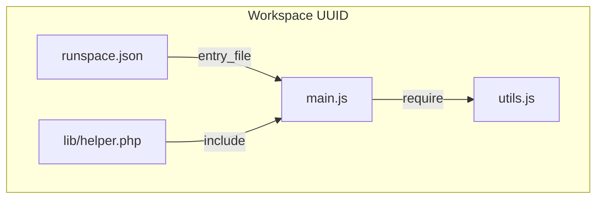

# Phase 5 — Workspace file management

**Estimated duration:** 5 days  
**Dependencies:** Phase 4 completed  

---

## Goal

Move from single-file snippets to mini-projects: file explorer in sidebar, editor tabs, workspace manifest, and local import support inside the sandbox (Node `require`, PHP `include`).

---

## What this phase covers

1. File tree in sidebar with file/folder CRUD
2. Monaco tabs for multiple open files
3. `runspace.json` manifest per workspace
4. Workspace persistence between sessions
5. Execute active file or configured entry point
6. Tauri filesystem commands with restricted scope

---

## Workspace model



**On-disk structure:**

```
~/.runspace/workspaces/a1b2c3d4/
  runspace.json
  main.js
  utils.js
  lib/
    helper.php
```

**`runspace.json` manifest:**

```json
{
  "name": "My snippet",
  "runtime_id": "nodejs",
  "entry_file": "main.js",
  "created_at": "2026-06-09T10:00:00Z",
  "updated_at": "2026-06-09T12:30:00Z"
}
```

---

## How to implement

### 1. Extended WorkspaceManager

**New responsibilities:**

| Method | Description |
|--------|-------------|
| `list_workspaces()` | List workspaces in `~/.runspace/workspaces/` |
| `open_workspace(id)` | Load workspace by UUID |
| `create_named_workspace(name)` | Create with manifest |
| `read_manifest(ws)` | Read `runspace.json` |
| `write_manifest(ws, manifest)` | Update manifest |
| `list_files(ws, relative_path)` | List directory |
| `read_file(ws, path)` | Read content |
| `write_file(ws, path, content)` | Write/create file |
| `delete_file(ws, path)` | Delete file or folder |
| `rename_file(ws, old, new)` | Rename/move |

**Path validation:**

- Reject `..` in relative paths
- Reject absolute paths outside workspace
- Reuse `SecurityLayer::validate_path_in_workspace`

### 2. Tauri commands — filesystem

**Location:** `src-tauri/src/commands/workspace.rs`

```rust
#[tauri::command]
fn list_workspaces(state: State<AppState>) -> Result<Vec<WorkspaceInfo>, String>;

#[tauri::command]
fn open_workspace(state: State<AppState>, id: String) -> Result<WorkspaceInfo, String>;

#[tauri::command]
fn create_workspace(state: State<AppState>, name: String, runtime_id: String) -> Result<WorkspaceInfo, String>;

#[tauri::command]
fn list_files(state: State<AppState>, relative_path: Option<String>) -> Result<Vec<FileEntry>, String>;

#[tauri::command]
fn read_file(state: State<AppState>, path: String) -> Result<String, String>;

#[tauri::command]
fn write_file(state: State<AppState>, path: String, content: String) -> Result<(), String>;

#[tauri::command]
fn delete_file(state: State<AppState>, path: String) -> Result<(), String>;

#[tauri::command]
fn rename_file(state: State<AppState>, old_path: String, new_path: String) -> Result<(), String>;
```

```rust
#[derive(Serialize)]
pub struct FileEntry {
    pub name: String,
    pub path: String,       // relative to workspace
    pub is_directory: bool,
}
```

**Permissions:** FS scope limited to `~/.runspace/workspaces/**`.

### 3. File tree (sidebar)

**Location:** `src/components/files/FileTree.tsx`

**Features:**

| Action | UI |
|--------|-----|
| Expand/collapse folders | Chevron + click |
| Open file | Click → opens editor tab |
| Create file | Context menu / `+` button |
| Create folder | Context menu |
| Rename | F2 or context menu |
| Delete | Delete or context menu + confirmation |
| Refresh | Refresh button |

**State:** `src/stores/workspaceStore.ts`

```typescript
interface WorkspaceStore {
  workspace: WorkspaceInfo | null;
  files: FileEntry[];
  expandedDirs: Set<string>;
  loadWorkspace: (id: string) => Promise<void>;
  refreshFiles: () => Promise<void>;
  createFile: (path: string) => Promise<void>;
  deleteFile: (path: string) => Promise<void>;
  renameFile: (oldPath: string, newPath: string) => Promise<void>;
}
```

**Icons by extension:** `.js`, `.php`, `.py`, `.rb`, `.c`, `.cpp` (simple color map).

### 4. Editor tabs

**Location:** `src/components/editor/EditorTabs.tsx`

**Behavior:**

- One tab per open file
- Active tab determines which file Monaco shows
- Dirty indicator (`•`) if content !== saved on disk
- Close tab: confirm if unsaved changes
- On save (`Cmd+S`): `write_file` + clear indicator

**Store:** `src/stores/editorTabsStore.ts`

```typescript
interface OpenFile {
  path: string;
  content: string;
  dirty: boolean;
  language: string;  // inferred from extension
}

interface EditorTabsStore {
  openFiles: OpenFile[];
  activePath: string | null;
  openFile: (path: string) => Promise<void>;
  closeFile: (path: string) => void;
  setActive: (path: string) => void;
  updateContent: (path: string, content: string) => void;
  saveFile: (path: string) => Promise<void>;
  saveActiveFile: () => Promise<void>;
}
```

**Language inference by extension:**

| Extension | Monaco language |
|-----------|-----------------|
| `.js` | javascript |
| `.ts` | typescript |
| `.php` | php |
| `.py` | python |
| `.rb` | ruby |
| `.c` | c |
| `.cpp`, `.cc` | cpp |

### 5. Execution with entry file

**Change to `execute_code`:**

```rust
pub async fn execute_code(
    ...
    entry_file: Option<String>,  // default: manifest.entry_file or active file
) -> Result<(), String>
```

**Flow:**

1. Resolve `entry_file` (UI param > manifest > `main.{ext}`)
2. Read file content from disk (not editor buffer — or sync before run)
3. **Important:** auto-save active file before Run
4. Execute with adapter per `manifest.runtime_id`

**Multi-file Node example:**

```javascript
// utils.js
module.exports = { greet: (name) => `Hello, ${name}!` };

// main.js
const { greet } = require('./utils');
console.log(greet('Runspace'));
```

**Multi-file PHP:**

```php
// main.php
include 'lib/helper.php';
echo greet('Runspace');
```

### 6. Session persistence

**On app close:**

- Save `~/.runspace/session.json`:
```json
{
  "last_workspace_id": "a1b2c3d4",
  "open_files": ["main.js", "utils.js"],
  "active_file": "main.js"
}
```

**On app open:**

- Load last workspace or create new default
- Restore open tabs

### 7. Create new workspace

**Basic Welcome flow in this phase:**

- If no workspaces: create "Untitled" with selected runtime template
- "New workspace" button in sidebar header

---

## Key files to create/modify

| File | Action |
|------|--------|
| `src-tauri/src/workspace/manager.rs` | Extend API |
| `src-tauri/src/commands/workspace.rs` | FS commands |
| `src/components/files/FileTree.tsx` | Tree UI |
| `src/components/files/FileTreeItem.tsx` | Recursive item |
| `src/components/editor/EditorTabs.tsx` | Tabs |
| `src/stores/workspaceStore.ts` | Workspace state |
| `src/stores/editorTabsStore.ts` | Tabs state |
| `src/core/types/workspace.ts` | Types |
| `src-tauri/src/commands/execution.rs` | entry_file |

---

## Phase completion checklist

Everything below must be checked before marking Phase 5 as done.

### Backend (Rust)

- [ ] `WorkspaceManager` extended: list/open/create workspaces, CRUD files, manifest
- [ ] `runspace.json` manifest read/write (name, runtime_id, entry_file, timestamps)
- [ ] Path validation rejects `..` and paths outside workspace
- [ ] Tauri workspace commands: `list_workspaces`, `open_workspace`, `create_workspace`, `list_files`, `read_file`, `write_file`, `delete_file`, `rename_file`
- [ ] `execute_code` accepts `entry_file`; auto-reads from disk before run
- [ ] `session.json` persists last workspace, open files, active file
- [ ] FS permissions scoped to `~/.runspace/workspaces/**`

### Frontend

- [ ] `FileTree` with expand/collapse, create, rename, delete, refresh
- [ ] `EditorTabs` with dirty indicator, close confirmation, `Cmd+S` save
- [ ] Language inferred from file extension in Monaco
- [ ] `workspaceStore` and `editorTabsStore` implemented
- [ ] "New workspace" flow when none exist
- [ ] Session restored on app launch (workspace + tabs)

### Verification

- [ ] Node: `utils.js` + `main.js` with `require('./utils')` works
- [ ] PHP: local `include` works
- [ ] File tree updates in real time on CRUD operations
- [ ] Tabs switch between open files without crash
- [ ] Closing active tab does not crash app
- [ ] Run auto-saves active file before executing
- [ ] Cannot create file with path `../outside.txt`
- [ ] `runspace.json` created and updated correctly

### Tests

- [ ] Rust unit: path validation rejects `..`
- [ ] Rust integration: Node multi-file `require` in temp workspace
- [ ] Manual: full file tree CRUD and rename open file

### Documentation & PR

- [ ] `CHANGELOG.md` entry added for Phase 5
- [ ] PR includes screenshot of file tree + multi-tab editor
- [ ] PR description lists what is explicitly out of scope
- [ ] CI passes

---

## Tests

| Type | What to test |
|------|--------------|
| Rust unit | Path validation; reject `..` |
| Rust integration | Node multi-file require in temp workspace |
| Manual | Full CRUD in file tree |
| Manual | Renaming open file updates tab |

---

## Out of scope

- Import external project (open user folder)
- Git integration
- File search
- Drag & drop files
- npm/composer install
- Watch mode / code hot reload

---

## Risks and mitigations

| Risk | Mitigation |
|------|------------|
| Editor and disk out of sync | Auto-save before Run; dirty indicator |
| Renaming file breaks imports | Warn user; no auto-refactor |
| Many files slow tree | Lazy load subdirectories |
| Path traversal | Strict validation in Rust |

---

## Phase deliverable

Runspace works as a mini-IDE with an isolated local project, multiple files, and configured entry point execution.
