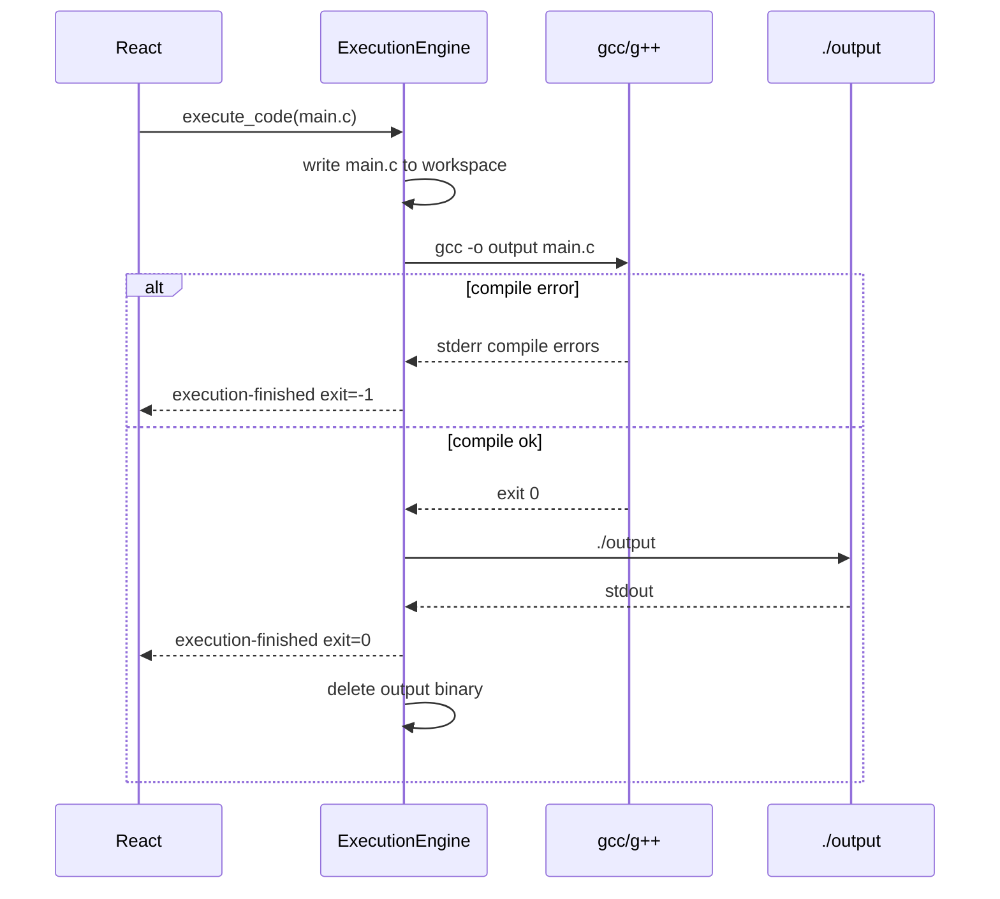

# Phase 6 — C/C++ (compiled languages)

**Estimated duration:** 4 days  
**Dependencies:** Phase 5 completed  

---

## Goal

Support C and C++ execution by compiling in the sandbox followed by running the generated binary. Show compilation errors clearly and clean up artifacts after each run.

---

## What this phase covers

1. `GccAdapter` and `GppAdapter`
2. Two-phase compile-then-run pipeline
3. Separate timeouts for compilation and execution
4. Monaco C and C++ modes
5. Compiler error presentation in Errors tab
6. Binary cleanup in sandbox

---

## Execution pipeline



---

## How to implement

### 1. Compiled adapters

**Location:** `src-tauri/src/engine/adapters/gcc.rs`, `gpp.rs`

```rust
pub struct GccAdapter;

impl RuntimeAdapter for GccAdapter {
    fn runtime_id(&self) -> &str { "gcc" }
    fn file_extension(&self) -> &str { "c" }
    fn default_template(&self) -> &str {
        "#include <stdio.h>\n\nint main() {\n    printf(\"Hello from C!\\n\");\n    return 0;\n}\n"
    }
    // build_command NOT used directly; special compile pipeline
}

pub struct GppAdapter;

impl RuntimeAdapter for GppAdapter {
    fn runtime_id(&self) -> &str { "gpp" }
    fn file_extension(&self) -> &str { "cpp" }
    fn default_template(&self) -> &str {
        "#include <iostream>\n\nint main() {\n    std::cout << \"Hello from C++!\" << std::endl;\n    return 0;\n}\n"
    }
}
```

**Extended trait for compiled runtimes:**

```rust
pub trait CompiledAdapter: RuntimeAdapter {
    fn compile_command(&self, binary: &Path, source: &Path, output: &Path) -> Command;
    fn output_binary_name(&self) -> &str { "runspace_out" }
    fn compile_timeout_secs(&self) -> u64 { 15 }
    fn run_timeout_secs(&self) -> u64 { 30 }
}

impl GccAdapter {
    fn compile_command(&self, gcc: &Path, source: &Path, output: &Path) -> Command {
        let mut cmd = Command::new(gcc);
        cmd.args(["-o", output.to_str().unwrap(), source.to_str().unwrap()]);
        cmd.arg("-Wall");  // useful warnings in Errors tab
        cmd
    }
}
```

### 2. CompiledExecutionPipeline

**Location:** `src-tauri/src/engine/compiled.rs`

```rust
pub struct CompiledExecutionResult {
    pub compile_exit_code: Option<i32>,
    pub compile_stderr: String,
    pub run_result: Option<ExecutionResult>,
    pub compile_failed: bool,
}

pub fn run_compiled(
    engine: &ExecutionEngine,
    app: AppHandle,
    adapter: &dyn CompiledAdapter,
    compiler_binary: &Path,
    source_content: &str,
    workspace: &Workspace,
    env: HashMap<String, String>,
) -> Result<CompiledExecutionResult, ExecutionError> {
    // 1. Write source file
    // 2. Compile phase with compile_timeout_secs
    // 3. If compile fails → emit errors, return compile_failed=true
    // 4. Run phase: execute ./runspace_out with run_timeout_secs
    // 5. Cleanup: delete runspace_out (and .o if present)
}
```

**Artifact names:**

| File | Purpose |
|------|---------|
| `main.c` / `main.cpp` | Source |
| `runspace_out` | Compiled binary (no extension) |
| `runspace_out.dSYM` | macOS debug symbols (clean up too) |

### 3. Extended Tauri events

| Event | When |
|-------|------|
| `execution-phase` | `{ phase: "compile" \| "run" }` |
| `execution-output` | compile or run stdout/stderr |
| `execution-finished` | `{ exit_code, timed_out, compile_failed }` |

**UI:** show current phase in StatusBar: `Compiling...` → `Running...`

### 4. Compilation error presentation

**GCC example:**

```
main.c:3:5: error: expected ';' before 'return'
    return 0;
    ^
```

**Errors tab UI:**

- `[compile]` prefix on compile-phase stderr
- `[runtime]` prefix on run-phase stderr
- Optional syntax highlighting for `file:line:col: error:` lines

**Light parser (optional):**

```rust
fn parse_gcc_error(line: &str) -> Option<(String, u32, u32, String)> {
    // main.c:3:5: error: message
}
```

If parse succeeds, show clickable link to Monaco line (post-MVP nice-to-have; MVP shows text only).

### 5. Monaco — C and C++

| runtime_id | Language | Default extension |
|------------|----------|-------------------|
| gcc | `c` | `main.c` |
| gpp | `cpp` | `main.cpp` |

Add to `RUNTIME_LANGUAGES` and `RUNTIME_TEMPLATES`.

### 6. Binary-specific security

**Risks:**

- Compiled binary can make arbitrary syscalls
- User could compile code accessing outside sandbox

**Mitigations (from Phase 1 `SecurityLayer`):**

- cwd = workspace
- Sanitized env
- Binary only runnable from workspace
- Delete binary after execution (prevent manual re-run)
- No custom compile flags in MVP (`-o /tmp/evil`)

**Forbidden flags:**

```rust
const FORBIDDEN_FLAGS: &[&str] = &["-o", "-save-temps", "-wrapper", "@"];
// Only allow: -o runspace_out (hardcoded), -Wall, -std=c11/c++17
```

### 7. Multi-file C (limited)

**MVP:** single-file only. If user has `helper.c`:

- Do not auto-compile multiple sources
- Document: "Multi-file C/C++ post-MVP"

**Future phase:**

```bash
gcc -o output main.c helper.c
```

### 8. Settings — compile timeouts

In `settings.json`:

```json
{
  "compile_timeout_secs": 15,
  "run_timeout_secs": 30
}
```

Expose in Security Settings or runtime-specific settings.

---

## Key files to create/modify

| File | Action |
|------|--------|
| `src-tauri/src/engine/adapters/gcc.rs` | GccAdapter |
| `src-tauri/src/engine/adapters/gpp.rs` | GppAdapter |
| `src-tauri/src/engine/compiled.rs` | Compile-run pipeline |
| `src-tauri/src/engine/adapters/mod.rs` | CompiledAdapter trait |
| `src-tauri/src/commands/execution.rs` | Compiled branch |
| `src/core/templates/index.ts` | C/C++ templates |
| `src/components/output/OutputPanel.tsx` | Compile/run phases |
| `src/stores/executionStore.ts` | `phase` state |

---

## Phase completion checklist

Everything below must be checked before marking Phase 6 as done.

### Backend (Rust)

- [ ] `GccAdapter` and `GppAdapter` implemented
- [ ] `CompiledAdapter` trait with compile/run timeouts
- [ ] `CompiledExecutionPipeline` in `compiled.rs`: compile → run → cleanup
- [ ] `execution-phase` event emitted (`compile` | `run`)
- [ ] Compile errors prefixed `[compile]`; runtime errors prefixed `[runtime]`
- [ ] Forbidden compiler flags rejected; output path hardcoded to `runspace_out`
- [ ] Binary and `.dSYM` cleaned up after every run (success or failure)
- [ ] `compile_timeout_secs` and `run_timeout_secs` in settings

### Frontend

- [ ] Monaco `c` and `cpp` modes wired for gcc/gpp runtimes
- [ ] C/C++ templates in `RUNTIME_TEMPLATES`
- [ ] `OutputPanel` / `StatusBar` show compile vs run phase
- [ ] `executionStore` tracks `phase` state

### Verification

- [ ] C: `printf("hello\n")` compiles and prints "hello"
- [ ] C++: `std::cout` compiles and runs
- [ ] C syntax error shows gcc message in Errors tab with `[compile]` prefix
- [ ] Compilation >15s aborts with timeout
- [ ] `runspace_out` not left on disk after run
- [ ] StatusBar: "Compiling..." → "Running..."
- [ ] Cannot inject `-o /etc/passwd` via user code or flags

### Tests

- [ ] Rust unit: `compile_command` args, forbidden flags rejected
- [ ] Rust integration: hello world C in temp dir (`#[ignore]` if no gcc)
- [ ] Rust integration: compile error returns `compile_failed: true`
- [ ] Manual: C++ iostream hello world

### Documentation & PR

- [ ] `CHANGELOG.md` entry added for Phase 6
- [ ] PR includes screenshot of compile error in Errors tab
- [ ] PR description lists what is explicitly out of scope
- [ ] CI passes

---

## Tests

| Type | What to test |
|------|--------------|
| Rust unit | `compile_command` generates correct args |
| Rust unit | Forbidden flags rejected |
| Rust integration | Hello world C in temp dir |
| Rust integration | Compile error returns compile_failed |
| Manual | C++ with iostream |
| Manual | Verify runspace_out not left on disk |

---

## Out of scope

- Multi-file C/C++ projects
- CMake, Makefile, meson
- gdb/lldb debugging
- Optimization flags (`-O2`, `-O3`)
- External libraries (`-lmath` edge cases documented)
- Cross-compilation
- clang as gcc alternative

---

## Risks and mitigations

| Risk | Mitigation |
|------|------------|
| gcc not installed on macOS (Xcode CLI) | Detect in RuntimeManager; Xcode guide |
| .dSYM not cleaned on macOS | Glob `runspace_out*` on cleanup |
| Successful compile, segfault on run | Show exit code != 0; stderr if any |
| User compiles `#include </etc/...>` | Fails at compile; not FS sandbox bypass |

---

## Phase deliverable

Runspace runs C and C++ with a secure compile-run pipeline, readable compilation errors, and artifact cleanup. Completes the MVP runtime catalog.
