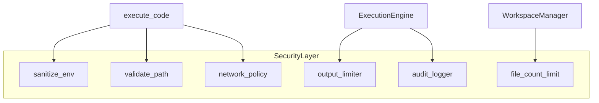

# Phase 6 — Hardened security and isolation

**Estimated duration:** 5 days  
**Dependencies:** Phase 5 completed  
**Suggested PR:** `feat/phase-6-security`

---

## Goal

Harden the sandbox before expanding attack surface (C/C++, more runtimes, public release). Document the threat model, apply network and filesystem policies, sanitize the environment, limit resources, and log execution audit trails.

---

## What this phase covers

1. Network policy (off by default)
2. Directory whitelist for child process
3. Extended environment variable sanitization
4. Output and workspace file limits
5. Local audit log
6. First-run consent screen
7. `SECURITY.md` document

---

## Threat model (summary)

| Threat | Impact | MVP mitigation |
|--------|--------|----------------|
| Malicious code reads user files | High | Sandbox cwd; no access outside workspace |
| Network exfiltration | High | Network disabled by default |
| Environment token theft | High | Sanitize env vars |
| DoS via infinite output | Medium | 1 MB output limit |
| DoS via many files | Low | 50 file limit |
| Arbitrary binary execution | High | Registered runtimes only |

**Out of MVP scope:** seccomp, containers, full macOS App Sandbox.

---

## Security architecture



---

## How to implement

### 1. Persistent settings

**File:** `~/.runspace/settings.json`

```json
{
  "allow_network": false,
  "execution_timeout_secs": 30,
  "max_output_bytes": 1048576,
  "max_workspace_files": 50,
  "consent_given": false,
  "consent_given_at": null
}
```

**Tauri commands:**

```rust
#[tauri::command]
fn get_settings(state: State<AppState>) -> Result<Settings, String>;

#[tauri::command]
fn update_settings(state: State<AppState>, settings: Settings) -> Result<(), String>;

#[tauri::command]
fn give_execution_consent(state: State<AppState>) -> Result<(), String>;
```

### 2. Network policy

**Pragmatic MVP (macOS/Linux):**

Tauri does not offer per-process firewall natively. Options:

| Option | Complexity | MVP |
|--------|------------|-----|
| Document risk + UI toggle | Low | Yes |
| macOS `sandbox-exec` | Medium | Optional |
| Linux network namespace | High | No |

**MVP implementation:**

1. `allow_network: false` by default
2. If `false`: empty proxy env; document that there is no real OS-level network isolation
3. If `true`: show UI warning before executing
4. In `SECURITY.md`: be honest about limitations

**Post-MVP:** investigate `sandbox-exec` profile or container execution.

### 3. Extended environment sanitization

**Location:** `src-tauri/src/security/env.rs`

**Block prefixes:**

```
AWS_, AZURE_, GCP_, GOOGLE_, GITHUB_, GITLAB_, BITBUCKET_,
NPM_, PNPM_, YARN_, DOCKER_, KUBECONFIG, SSH_, GPG_,
CI_, TRAVIS_, CIRCLE_, JENKINS_, TAURI_, RUNSPACE_,
DATABASE_, DB_, MYSQL_, POSTGRES_, REDIS_, MONGO_,
SECRET, TOKEN, PASSWORD, PRIVATE_KEY, API_KEY
```

**Block exact names:**

```
HOME, USER, LOGNAME, SHELL, MAIL, PATH
```

**Explicitly allow:**

```
PATH          // required to find runtime
LANG, LC_ALL  // encoding
TMPDIR        // sandbox temp, override to workspace/tmp
```

**Sanitized PATH:**

- Build minimal PATH: runtime binary directory + `/usr/bin` + `/usr/local/bin`
- Do not propagate full user PATH (reduces surface)

```rust
pub fn build_safe_env(runtime_binary: &Path, settings: &Settings) -> HashMap<String, String> {
    let mut env = HashMap::new();
    env.insert("PATH".into(), build_minimal_path(runtime_binary));
    env.insert("LANG".into(), "en_US.UTF-8".into());
    env.insert("TMPDIR".into(), workspace_tmp.to_string_lossy().into());
    env
}
```

### 4. Path validation

**Rules:**

```rust
pub fn validate_workspace_path(workspace: &Path, relative: &str) -> Result<PathBuf, SecurityError> {
    // 1. Reject if contains ".."
    // 2. Canonicalize workspace + join
    // 3. Verify result starts_with(canonical workspace)
}
```

**Pre-execution:**

- Verify `entry_file` exists and is in workspace
- Verify runtime `binary_path` is in configured runtime allowlist

### 5. Output limit

**Location:** `src-tauri/src/security/output_limiter.rs`

```rust
pub struct OutputLimiter {
    max_bytes: usize,
    stdout_bytes: usize,
    stderr_bytes: usize,
    truncated: bool,
}

impl OutputLimiter {
    pub fn append(&mut self, stream: &str, chunk: &str) -> Option<String> {
        // If exceeds max_bytes, set truncated=true and return None or truncated message
    }
}
```

**UI:** if `truncated`, show banner:

```
Output truncated (limit: 1 MB). Increase limit in Settings.
```

### 6. Workspace file limit

In `WorkspaceManager::write_file` and `create_file`:

```rust
fn count_files(workspace: &Path) -> Result<usize, _> {
    WalkDir::new(workspace).into_iter().filter(|e| e.is_file()).count()
}

// Before create: if count >= settings.max_workspace_files { return Err(...) }
```

### 7. Audit log

**File:** `~/.runspace/audit.log` (append-only, one JSON line per event)

```json
{"ts":"2026-06-09T14:30:00Z","event":"execution","runtime":"nodejs","entry":"main.js","exit":0,"duration_ms":45,"timed_out":false,"workspace_id":"a1b2c3d4"}
{"ts":"2026-06-09T14:31:00Z","event":"execution","runtime":"python","entry":"main.py","exit":1,"duration_ms":120,"timed_out":false,"workspace_id":"a1b2c3d4"}
```

**Do not log:** code content (privacy).

**API:**

```rust
pub fn log_execution(record: AuditRecord) -> Result<(), AuditError>;
```

**Optional UI:** Settings → View audit log (last 50 lines).

### 8. Consent screen

**First execution** (`consent_given === false`):

```
┌─────────────────────────────────────────────┐
│  Execute code in Runspace?                  │
│                                             │
│  Code runs in an isolated folder on your    │
│  machine using installed runtimes.          │
│  Network is disabled by default.            │
│                                             │
│  Only run code you trust.                   │
│                                             │
│  [Learn more]  [Cancel]  [I understand]     │
└─────────────────────────────────────────────┘
```

- **Learn more:** open `SECURITY.md` on GitHub or in-app panel
- **I understand:** `give_execution_consent()` + allow Run

### 9. SECURITY.md

**Location:** repository root

**Contents:**

1. What Runspace executes and what it does not guarantee
2. Sandbox model (isolated directory)
3. Network limitations in MVP
4. Filtered environment variables
5. How to report vulnerabilities
6. User recommendations

### 10. UI Settings — Security

**Location:** `src/components/settings/SecuritySettings.tsx`

| Setting | Control |
|---------|---------|
| Allow network | Toggle + warning |
| Timeout | Number input (5–300s) |
| Max output | Select: 256KB / 1MB / 5MB |
| Max files | Number (10–100) |

---

## Key files to create/modify

| File | Action |
|------|--------|
| `src-tauri/src/security/env.rs` | Extended sanitization |
| `src-tauri/src/security/output_limiter.rs` | Output limit |
| `src-tauri/src/security/audit.rs` | Audit log |
| `src-tauri/src/settings/mod.rs` | Persistent settings |
| `src/components/settings/SecuritySettings.tsx` | UI |
| `src/components/dialogs/ConsentDialog.tsx` | Consent |
| `SECURITY.md` | Documentation |
| `src-tauri/src/engine/executor.rs` | Integrate limiter + audit |

---

## Phase completion checklist

Everything below must be checked before marking Phase 6 as done.

### Backend (Rust)

- [ ] `settings.json` persisted with security defaults (`allow_network: false`, limits, consent)
- [ ] Tauri commands: `get_settings`, `update_settings`, `give_execution_consent`
- [ ] Extended env sanitization (`env.rs`): block prefixes, minimal PATH, safe TMPDIR
- [ ] `validate_workspace_path` enforced on all file operations
- [ ] `OutputLimiter` truncates stdout/stderr at configured max bytes
- [ ] Workspace file count limit enforced on create
- [ ] `audit.log` append-only JSON lines per execution (no code content)
- [ ] Security policies integrated into `ExecutionEngine`

### Frontend

- [ ] `SecuritySettings` panel: network toggle, timeout, max output, max files
- [ ] `ConsentDialog` shown on first execution before Run is allowed
- [ ] Truncation banner shown when output exceeds limit
- [ ] Network toggle shows warning when enabled

### Documentation

- [ ] `SECURITY.md` at repo root: threat model, sandbox limits, network honesty, reporting

### Verification

- [ ] Node `fs.readFileSync('/etc/passwd')` fails or file not found
- [ ] Python cannot read `~/.ssh/id_rsa` from sandbox
- [ ] Output > 1 MB truncated with visible notice
- [ ] File #51 in workspace rejected with error
- [ ] `AWS_ACCESS_KEY_ID` not in child env (automated test)
- [ ] Child PATH is minimal, not full user PATH
- [ ] Every execution logged in `audit.log`
- [ ] Consent dialog on first run; not shown after consent given

### Tests

- [ ] Rust unit: `sanitize_env`, `validate_workspace_path`, `OutputLimiter`
- [ ] Rust integration: polluted parent env does not reach child

### Documentation & PR

- [ ] `CHANGELOG.md` entry added for Phase 6
- [ ] PR includes screenshot of consent dialog and security settings
- [ ] PR description lists what is explicitly out of scope
- [ ] CI passes

---

## Tests

| Type | What to test |
|------|--------------|
| Rust unit | `sanitize_env` blocks prefixes and names |
| Rust unit | `validate_workspace_path` rejects `..` |
| Rust unit | `OutputLimiter` truncates at limit |
| Rust integration | Spawn node with polluted env; verify clean child |
| Manual | Consent dialog on first execution |
| Manual | Verify audit.log after several runs |

---

## Out of scope

- Real network isolation (firewall, namespaces)
- Seccomp / Landlock
- Full macOS App Sandbox entitlement
- Audit log encryption
- Linux capability sandboxing for compilers
- Malicious code detection / antivirus

---

## Risks and mitigations

| Risk | Mitigation |
|------|------------|
| User believes network is truly blocked | Document in SECURITY.md and UI |
| Minimal PATH breaks some runtimes | Allow override in advanced settings (post-MVP) |
| Audit log grows indefinitely | Document manual rotation; auto-rotate post-MVP |
| False positives in env block | Conservative list; log blocked vars in debug |

---

## Phase deliverable

Runspace with documented and applied security policies, ready for public release with clear expectations about what it protects and what it does not.
