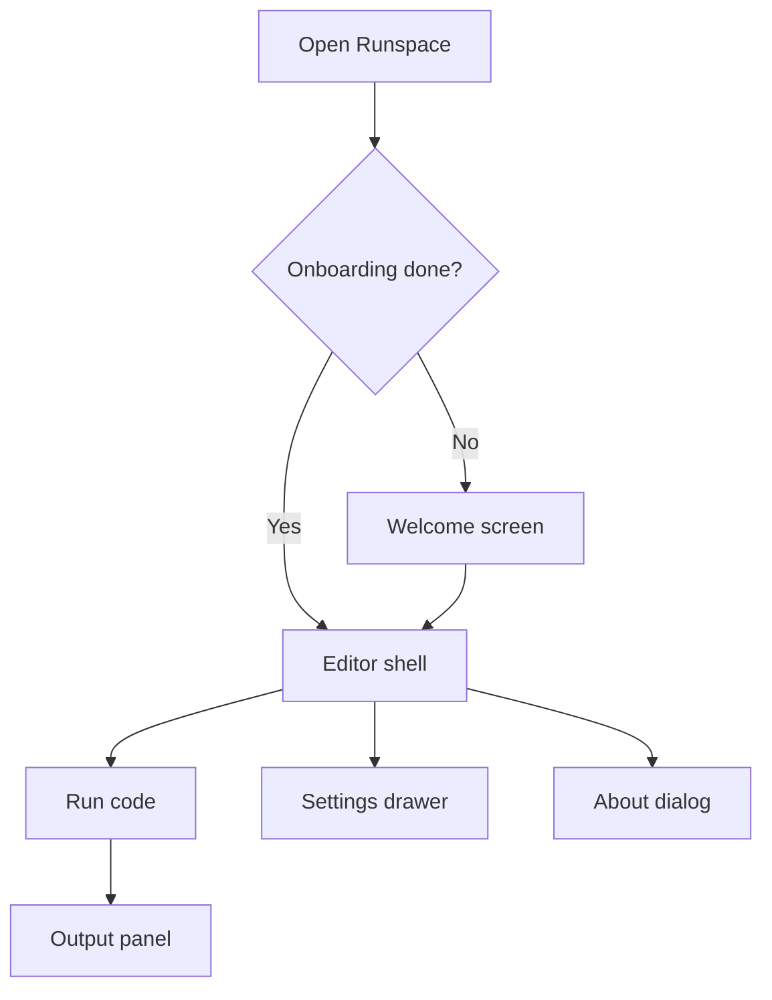

# Phase 7 — UI redesign and release v0.1.0

**Estimated duration:** 7 days  
**Dependencies:** Phases 0–6 completed (onboarding already shipped in prior work)

---

## Goal

Ship Runspace v0.1.0 as a polished, presentable product: a **full interface redesign** with a modern desktop-app feel, consistent branding, signed builds, final documentation, and full-flow smoke tests.

Onboarding (`WelcomeScreen`) and workspace flows are already implemented — this phase does **not** add a snippet library or rebuild onboarding logic. It **restyles and refines** every surface so the app feels cohesive, current, and intentional.

---

## What this phase covers

1. Design system and visual language (tokens, typography, motion)
2. Full UI rework: shell, toolbar, sidebar, editor chrome, output, settings, dialogs, welcome
3. Icon, name, and consistent branding
4. Signed macOS build
5. Documented keyboard shortcuts
6. About page
7. GitHub v0.1.0 release
8. README with screenshots

---

## Design direction

**Aesthetic:** dark-first IDE-inspired desktop app, but lighter and more refined than the current VS Code clone. Think **Raycast / Linear / Arc** level of polish: generous spacing, subtle depth, crisp typography, purposeful accent color — not flat gray boxes everywhere.

**Principles:**

| Principle | Application |
|-----------|-------------|
| Hierarchy | Clear primary actions (Run), secondary (settings), tertiary (chrome) |
| Density | Comfortable for long coding sessions; not cramped, not wasteful |
| Consistency | One button style, one input style, one panel style everywhere |
| Feedback | Hover, focus, active, running, success, error states are obvious |
| Native feel | macOS-friendly title bar integration, sensible shortcuts, system font stack with a distinctive display face for branding |

**Reference mood (not copy):** subtle glass/blur on overlays, soft borders (`1px` at low opacity), rounded corners (`8–12px` on panels, `6px` on controls), micro-animations on state changes (`150–200ms` ease).

---

## Target user flows



**UX goal:** returning user opens last workspace and runs code in under 30 seconds; first-time user still completes onboarding (existing flow) and lands in the redesigned shell.

---

## How to implement

### 1. Design system foundation

**Create:** `src/styles/tokens.css` (imported from `globals.css`)

```css
:root {
  /* Surfaces */
  --rs-bg-base: #141414;
  --rs-bg-elevated: #1c1c1e;
  --rs-bg-overlay: #242428;
  --rs-bg-subtle: rgba(255, 255, 255, 0.04);

  /* Borders */
  --rs-border-subtle: rgba(255, 255, 255, 0.08);
  --rs-border-strong: rgba(255, 255, 255, 0.14);

  /* Text */
  --rs-text-primary: #f5f5f7;
  --rs-text-secondary: #a1a1aa;
  --rs-text-muted: #71717a;

  /* Accent — teal/cyan, distinctive but not neon */
  --rs-accent: #2dd4bf;
  --rs-accent-hover: #5eead4;
  --rs-accent-muted: rgba(45, 212, 191, 0.12);

  /* Semantic */
  --rs-success: #4ade80;
  --rs-warning: #facc15;
  --rs-error: #f87171;
  --rs-info: #60a5fa;

  /* Spacing scale (4px base) */
  --rs-space-1: 4px;
  --rs-space-2: 8px;
  --rs-space-3: 12px;
  --rs-space-4: 16px;
  --rs-space-5: 20px;
  --rs-space-6: 24px;
  --rs-space-8: 32px;

  /* Radius */
  --rs-radius-sm: 6px;
  --rs-radius-md: 10px;
  --rs-radius-lg: 14px;
  --rs-radius-full: 999px;

  /* Motion */
  --rs-duration-fast: 120ms;
  --rs-duration-normal: 180ms;
  --rs-ease: cubic-bezier(0.4, 0, 0.2, 1);

  /* Typography */
  --rs-font-sans: "Inter", system-ui, -apple-system, BlinkMacSystemFont, sans-serif;
  --rs-font-mono: "JetBrains Mono", ui-monospace, SFMono-Regular, Menlo, monospace;
  --rs-font-size-xs: 11px;
  --rs-font-size-sm: 12px;
  --rs-font-size-md: 13px;
  --rs-font-size-lg: 15px;

  /* Shadows */
  --rs-shadow-sm: 0 1px 2px rgba(0, 0, 0, 0.35);
  --rs-shadow-md: 0 8px 24px rgba(0, 0, 0, 0.45);
  --rs-shadow-lg: 0 16px 48px rgba(0, 0, 0, 0.55);
}
```

**Fonts:** add Inter + JetBrains Mono via `@fontsource` packages or local `public/fonts/`. Load in `index.html` or `main.tsx`.

**Refactor CSS:** split `globals.css` into logical partials:

| File | Scope |
|------|-------|
| `tokens.css` | Variables only |
| `base.css` | Reset, scrollbars, body |
| `components/button.css` | `.btn` variants |
| `components/shell.css` | App shell, toolbar, status bar |
| `components/sidebar.css` | Sidebar, file tree, workspace switcher |
| `components/editor.css` | Tabs, editor area |
| `components/output.css` | Output panel, stream, badges |
| `components/settings.css` | Settings overlay, env cards |
| `components/dialog.css` | Dialogs, context menu |
| `components/welcome.css` | Welcome screen (restyle only) |

Replace hardcoded `#1e1e1e`, `#0e639c`, `#252526`, etc. with tokens across all partials.

### 2. Shared UI primitives

Introduce a thin component layer so screens stay consistent. **No heavy UI framework** — small wrappers over existing markup.

**Create:** `src/components/ui/`

| Component | Purpose |
|-----------|---------|
| `Button.tsx` | Primary, secondary, ghost, danger; sizes `sm` / `md`; optional shortcut hint |
| `IconButton.tsx` | Square icon-only control for toolbars |
| `Input.tsx` | Text input with label, error state, focus ring |
| `Badge.tsx` | Status pills (running, success, configured, etc.) |
| `Panel.tsx` | Elevated surface with optional header |
| `Divider.tsx` | Horizontal/vertical separator |
| `Kbd.tsx` | Keyboard shortcut chip |

Migrate `Toolbar`, `AppDialogs`, `ContextMenu`, and settings forms to use these primitives incrementally.

### 3. App shell and layout rework

**`AppShell` / `Toolbar` / `StatusBar`**

Current shell is functional but reads as generic. Target layout:

```
┌──────────────────────────────────────────────────────────────┐
│ [Logo] Runspace    [tabs........................]  [Run] [⚙]   │  ← unified top bar
├──────────┬───────────────────────────────────┬─────────────────┤
│ Sidebar  │         Monaco editor             │  Output (opt.)  │
│          │                                   │                 │
├──────────┴───────────────────────────────────┴─────────────────┤
│ status · environment · workspace · line info                   │
└──────────────────────────────────────────────────────────────┘
```

**Changes:**

- Toolbar: remove placeholder blue square logo; use real app icon + wordmark; Run as prominent accent button with clear running/stop states
- Editor tabs: pill-style or understated underline active state; smoother close affordance; better empty state illustration/copy
- Status bar: move from bright VS Code blue to subtle elevated bar; environment name as accent chip
- Sidebar: collapsible with animation; section headers with icons; file tree with proper file-type icons (SVG, not emoji)
- Output panel: collapsible bottom or right dock; tabbed stdout/stderr if needed; cleaner running indicator
- Resize handles: subtle drag affordance between sidebar / editor / output
- Focus mode (optional): `Cmd+B` hides sidebar with transition

**Tauri:** consider `titleBarStyle: "Overlay"` on macOS so custom toolbar blends with traffic lights (document in `tauri.conf.json`).

### 4. Screen-by-screen polish

| Screen | Work |
|--------|------|
| **Welcome** (`WelcomeScreen.tsx`) | Restyle to match new tokens; no flow changes. Progress dots, cards, and CTAs use design system |
| **File tree** | SVG icons per extension; hover/selection states; drag-drop highlight refined |
| **Workspace switcher** | Dropdown as elevated panel with search/filter if many workspaces |
| **Environment selector** | Compact chip in toolbar or sidebar header; menu with grouped runtimes |
| **Settings** | Full-width slide-over or centered modal; sidebar nav (Environments, General); card layout for env config |
| **Dialogs** | Confirm/save/rename — consistent header, body, footer; backdrop blur |
| **Output** | Monospace stream with line numbers optional; copy-all button; clear empty state |
| **Empty editor** | Short hint + "New file" / "Open workspace" actions |

### 5. Motion and micro-interactions

Keep motion subtle — desktop app, not a marketing site.

| Interaction | Treatment |
|-------------|-----------|
| Panel open/close | `transform` + `opacity`, 180ms |
| Button press | Slight scale `0.98` on active |
| Run started | Brief pulse on Run button; output panel auto-expands |
| Success/error | Badge color transition; optional checkmark flash |
| Settings overlay | Slide from right with backdrop fade |

Respect `prefers-reduced-motion: reduce` — disable transforms, keep instant state changes.

### 6. Branding

**App icon:**

- Design: terminal/sandbox motif — geometric, works at 16px; dark base + teal accent
- Tauri formats: `src-tauri/icons/icon.icns`, `icon.png` (1024×1024), `32x32.png`, etc.
- Tool: `npm run tauri icon path/to/source.png`

**Consistent naming:**

- Window: "Runspace"
- About: "Runspace v0.1.0"
- Identifier: `com.enegalan.runspace`

Apply icon in toolbar, welcome screen, About dialog, and dock.

### 7. Application menu (macOS)

**Location:** `src-tauri/src/lib.rs` or Tauri config menu

| Menu | Items |
|------|-------|
| File | New Workspace, Save, Close Tab |
| Edit | Undo, Redo, Cut, Copy, Paste (Monaco native) |
| Run | Run (⌘↵), Stop (⌘.), Clear Output |
| View | Toggle Sidebar, Toggle Output Panel |
| Help | Welcome, Keyboard Shortcuts, About Runspace |

Remove any snippet-related menu entries.

### 8. Keyboard shortcuts

**Document:** `docs/keyboard-shortcuts.md` + in-app panel (styled with `Kbd` component)

| Shortcut | Action |
|----------|--------|
| `Cmd+Enter` | Run |
| `Cmd+.` | Stop |
| `Cmd+S` | Save file |
| `Cmd+N` | New workspace |
| `Cmd+W` | Close tab |
| `Cmd+B` | Toggle sidebar |
| `Cmd+J` | Toggle output panel |
| `Cmd+,` | Settings |

Implement with Tauri global shortcuts or Monaco/editor handlers.

### 9. About page

**Component:** `src/components/about/AboutDialog.tsx`

```
[App icon]
Runspace v0.1.0
Desktop sandbox for multiple runtimes.

Runtimes: Node.js, PHP, Python, Ruby, C, C++

© 2026 Eneko Galan
MIT License

[GitHub] [Report issue]
```

Styled as a centered modal matching the new dialog pattern.

### 10. Signed macOS build

**Requirements:**

- Apple Developer account (for distribution outside Mac App Store, notarization)
- "Developer ID Application" certificate

**`tauri.conf.json`:**

```json
{
  "bundle": {
    "macOS": {
      "signingIdentity": "Developer ID Application: ...",
      "entitlements": "entitlements.plist"
    }
  }
}
```

**CI release workflow:** `.github/workflows/release.yml`

```yaml
on:
  push:
    tags: ['v*']

jobs:
  release:
    runs-on: macos-latest
    steps:
      - uses: actions/checkout@v4
      - name: Build and release
        uses: tauri-apps/tauri-action@v0
        env:
          APPLE_CERTIFICATE: ${{ secrets.APPLE_CERTIFICATE }}
          APPLE_CERTIFICATE_PASSWORD: ${{ secrets.APPLE_CERTIFICATE_PASSWORD }}
          APPLE_SIGNING_IDENTITY: ${{ secrets.APPLE_SIGNING_IDENTITY }}
```

**Without certificate (dev):** unsigned build for local testing; document in README.

### 11. Auto-updater (optional v0.1)

Can be deferred to v0.1.1 if it complicates initial release.

### 12. CHANGELOG and version

**`CHANGELOG.md`:**

```markdown
## [0.1.0] - 2026-XX-XX

### Added
- Desktop app with Monaco editor
- Runtimes: Node.js, PHP, Python, Ruby, C, C++
- Runtime detection and configuration
- Workspace file management
- Onboarding welcome flow
- Workspace sandbox (isolated cwd, sanitized env)

### Changed
- Full UI redesign with modern design system
```

**Versions:**

- `package.json`: `"version": "0.1.0"`
- `tauri.conf.json`: `"version": "0.1.0"`
- `Cargo.toml`: `version = "0.1.0"`

### 13. Final README

**Sections:**

1. Hero + screenshot (new UI)
2. What Runspace is
3. Supported runtimes (table)
4. Installation (download release / build from source)
5. Quick start (3 steps)
6. Development setup
7. Roadmap (Laravel, auto-installers, snippet library, etc.)
8. License

**Screenshots:** capture on macOS retina after UI rework, save in `docs/images/`:

- `shell-editor.png` — main editor with sidebar and output
- `welcome.png` — onboarding (restyled)
- `runtimes-settings.png` — settings / environments
- `multi-file.png` — tabs + file tree

### 14. Smoke test checklist (manual QA)

Document `docs/qa/smoke-test-v0.1.0.md`:

- [ ] App opens without crash
- [ ] Onboarding flow works on fresh profile (existing behavior)
- [ ] Quick start → hello output
- [ ] Switch runtime → run template
- [ ] Create file in file tree
- [ ] Settings → Environments → refresh
- [ ] C compile hello world
- [ ] Stop during infinite loop
- [ ] Close and reopen → restores workspace
- [ ] Sidebar/output toggle shortcuts work
- [ ] UI: no broken layouts at min window size (1024×640)

---

## Key files to create/modify

| File | Action |
|------|--------|
| `src/styles/tokens.css` | Design tokens |
| `src/styles/components/*.css` | Split and restyle CSS |
| `src/components/ui/Button.tsx` (etc.) | Shared primitives |
| `src/components/layout/*` | Shell rework |
| `src/components/welcome/WelcomeScreen.tsx` | Restyle only (no flow changes) |
| `src/components/about/AboutDialog.tsx` | About |
| `src-tauri/icons/*` | App icons |
| `docs/keyboard-shortcuts.md` | Shortcuts |
| `docs/images/*` | Screenshots (post-redesign) |
| `docs/qa/smoke-test-v0.1.0.md` | QA checklist |
| `.github/workflows/release.yml` | Release CI |
| `CHANGELOG.md` | Changelog |
| `README.md` | Final documentation |

---

## Phase completion checklist

Everything below must be checked before marking Phase 7 (and MVP v0.1.0) as done.

### Design system & UI

- [ ] `tokens.css` with full token set; no raw hex in component CSS (except token definitions)
- [ ] Inter + JetBrains Mono loaded; typography applied consistently
- [ ] Shared UI primitives (`Button`, `Input`, `Badge`, etc.) used in toolbar, dialogs, settings
- [ ] App shell reworked: toolbar, sidebar, tabs, output, status bar
- [ ] File tree uses SVG icons; emoji icons removed
- [ ] Settings panel matches new visual language
- [ ] Welcome screen restyled (onboarding logic unchanged)
- [ ] `prefers-reduced-motion` respected
- [ ] Layout usable at 1024×640 minimum

### Branding & UX

- [ ] Custom app icon generated (`npm run tauri icon`)
- [ ] Icon visible in toolbar, dock, About
- [ ] macOS app menu: File, Edit, Run, View, Help (no snippet items)
- [ ] `AboutDialog` with version, runtimes, license, links
- [ ] Keyboard shortcuts implemented and documented in `docs/keyboard-shortcuts.md`

### Release

- [ ] Version bumped to `0.1.0` in `package.json`, `tauri.conf.json`, `Cargo.toml`
- [ ] `CHANGELOG.md` complete for v0.1.0
- [ ] `README.md` final: hero, screenshots, runtime table, install, quick start
- [ ] Screenshots in `docs/images/` (captured after UI rework)
- [ ] `docs/qa/smoke-test-v0.1.0.md` checklist completed
- [ ] `tauri build` produces installable `.dmg` or `.app`
- [ ] `.github/workflows/release.yml` configured (signed build if certs available)
- [ ] Git tag `v0.1.0` pushed with GitHub Release assets

### Verification (smoke test)

- [ ] Returning user: open app → last workspace → run in < 30 s
- [ ] Fresh profile: onboarding → first project → run in < 2 min
- [ ] Custom icon visible in dock and About
- [ ] All keyboard shortcuts work
- [ ] No crashes in main flow (10 consecutive runs)
- [ ] Quick start works for Python, PHP, Ruby, C, C++ (if runtimes installed)
- [ ] Close and reopen restores last workspace

### Tests

- [ ] E2E: onboarding → first project → run (existing tests updated for new selectors if needed)
- [ ] E2E: workspace file CRUD + run
- [ ] Visual regression: key screens captured (optional Playwright screenshots)
- [ ] Manual: full `docs/qa/smoke-test-v0.1.0.md` on clean machine

### Documentation & PR

- [ ] Final PR merged to `main`
- [ ] Release notes published on GitHub
- [ ] Post-MVP roadmap documented in README (snippet library listed as future work)

---

## Tests

| Type | What to test |
|------|--------------|
| E2E | Onboarding → first project → run |
| E2E | Workspace file create → save → run |
| Visual | Shell, settings, welcome match design (screenshot diff optional) |
| Manual | Full smoke test |
| Manual | Install .app on clean machine |

---

## Out of scope

- Snippet library (deferred to v0.2+)
- Rebuilding onboarding logic (already shipped)
- Windows/Linux builds in v0.1.0 (document as "coming soon")
- Mac App Store distribution
- Auto-updater (if deferred)
- Telemetry / analytics
- i18n localization
- Light theme toggle (dark only in v0.1)
- Website landing page
- Full component library / Radix / shadcn adoption (keep primitives minimal)

---

## Risks and mitigations

| Risk | Mitigation |
|------|------------|
| UI rework scope creep | Freeze token set early; screen checklist; timebox motion work |
| CSS split breaks layout | Migrate one area at a time; keep E2E green after each merge |
| Notarization fails | Document unsigned build; iterate certs |
| Outdated screenshots | Capture only after UI sign-off |
| Font loading flash | Preload fonts; fallback to system stack |
| Release CI secrets not configured | Manual release first time |

---

## Phase deliverable

**Runspace v0.1.0** published on GitHub Releases: functional, documented desktop app with a **modern redesigned interface**, all MVP runtimes, and polished day-to-day workflow.

---

## Post-release (v0.2 preview)

Ideas for next iteration (not in this phase):

- Snippet library (save/reuse code across workspaces)
- Laravel/Symfony sandbox enhancements
- Automatic runtime installers
- Windows/Linux builds
- Auto-updater
- TypeScript in Node (integrated esbuild)
- Export workspace as zip
- Light theme
