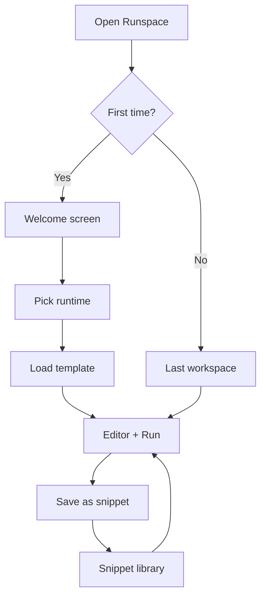

# Phase 8 — Polish and release v0.1.0

**Estimated duration:** 5 days  
**Dependencies:** Phases 0–7 completed  
**Suggested PR:** `feat/phase-8-release-v0.1.0`

---

## Goal

Turn Runspace into a presentable product for public v0.1.0 release: snippet library, Welcome screen, branding, signed builds, final documentation, and full-flow smoke tests.

---

## What this phase covers

1. Snippet library (local CRUD)
2. Welcome screen with onboarding
3. Icon, name, and consistent branding
4. Signed macOS build
5. Documented keyboard shortcuts
6. About page
7. GitHub v0.1.0 release
8. README with screenshots

---

## Target user flows



**UX goal:** new user runs Node.js in under 2 minutes from opening the app.

---

## How to implement

### 1. Snippet library

**Storage:** `~/.runspace/snippets/{uuid}.json`

```json
{
  "id": "550e8400-e29b-41d4-a716-446655440000",
  "name": "Fibonacci",
  "runtime_id": "python",
  "code": "def fib(n):\n    ...",
  "created_at": "2026-06-09T10:00:00Z",
  "updated_at": "2026-06-09T10:00:00Z",
  "tags": ["algorithm"]
}
```

**Tauri commands:**

```rust
#[tauri::command]
fn list_snippets() -> Result<Vec<SnippetMeta>, String>;

#[tauri::command]
fn get_snippet(id: String) -> Result<Snippet, String>;

#[tauri::command]
fn save_snippet(snippet: Snippet) -> Result<Snippet, String>;

#[tauri::command]
fn delete_snippet(id: String) -> Result<(), String>;
```

**UI — SnippetLibrary:** `src/components/snippets/SnippetLibrary.tsx`

```
Snippets                          [+ New]
─────────────────────────────────────────
> Fibonacci          Python    2 days ago
  Hello Node         Node.js   1 week ago
  PHP array demo     PHP       2 weeks ago
```

**Actions:**

| Action | Description |
|--------|-------------|
| New | Save current editor as snippet (dialog: name + tags) |
| Open | Load snippet in editor; switch runtime if different |
| Delete | Confirm and delete |
| Duplicate | Create copy named "(copy)" |

**Access:** sidebar "Snippets" tab or File → Snippets menu.

### 2. Welcome screen

**Location:** `src/components/welcome/WelcomeScreen.tsx`

**Show when:**

- First launch (`~/.runspace/settings.json` → `welcome_seen: false`)
- Or no workspaces and no last snippet
- Accessible from Help → Welcome

**Content:**

```
┌─────────────────────────────────────────────────┐
│  [Logo]  Welcome to Runspace                    │
│                                                 │
│  Run code in isolated sandboxes using your      │
│  installed runtimes.                            │
│                                                 │
│  Quick start:                                   │
│  [Node.js] [Python] [PHP] [Ruby] [C] [C++]     │
│                                                 │
│  Recent:                                        │
│  • Untitled workspace (Node.js)                 │
│  • Fibonacci snippet (Python)                   │
│                                                 │
│  [Open last workspace]  [Browse snippets]       │
└─────────────────────────────────────────────────┘
```

**Quick start:** create new workspace with clicked runtime template and open editor.

### 3. Branding

**App icon:**

- Design: terminal/sandbox motif, dark colors + green/cyan accent
- Tauri formats: `src-tauri/icons/icon.icns`, `icon.png` (1024×1024), `32x32.png`, etc.
- Tool: `npm run tauri icon path/to/source.png`

**Consistent naming:**

- Window: "Runspace"
- About: "Runspace v0.1.0"
- Identifier: `com.enegalan.runspace`

**Typography and colors (design tokens):**

```css
:root {
  --rs-bg: #1e1e1e;
  --rs-surface: #252526;
  --rs-border: #333333;
  --rs-accent: #4ec9b0;
  --rs-text: #d4d4d4;
  --rs-error: #f48771;
}
```

Apply in `globals.css` and components.

### 4. Application menu (macOS)

**Location:** `src-tauri/src/lib.rs` or Tauri config menu

| Menu | Items |
|------|-------|
| File | New Workspace, Save, Save as Snippet, Snippets... |
| Edit | Undo, Redo, Cut, Copy, Paste (Monaco native) |
| Run | Run (⌘↵), Stop (⌘.), Clear Output |
| View | Toggle Sidebar, Toggle Output Panel |
| Help | Welcome, Keyboard Shortcuts, About Runspace |

### 5. Keyboard shortcuts

**Document:** `docs/keyboard-shortcuts.md` + in-app panel

| Shortcut | Action |
|----------|--------|
| `Cmd+Enter` | Run |
| `Cmd+.` | Stop |
| `Cmd+S` | Save file |
| `Cmd+Shift+S` | Save as snippet |
| `Cmd+N` | New workspace |
| `Cmd+W` | Close tab |
| `Cmd+B` | Toggle sidebar |
| `Cmd+J` | Toggle output panel |
| `Cmd+,` | Settings |

Implement with Tauri global shortcuts or Monaco/editor handlers.

### 6. About page

**Component:** `src/components/about/AboutDialog.tsx`

```
Runspace v0.1.0
Desktop sandbox for multiple runtimes.

Runtimes: Node.js, PHP, Python, Ruby, C, C++

© 2026 Eneko Galan
MIT License

[GitHub] [Report issue]
```

### 7. Signed macOS build

**Requirements:**

- Apple Developer account (for distribution outside Mac App Store, notarization)
- "Developer ID Application" certificate

**`tauri.conf.json`:**

```json
{
  "bundle": {
    "macOS": {
      "signingIdentity": "Developer ID Application: ...",
      "entitlements": "entitlements.plist"
    }
  }
}
```

**CI release workflow:** `.github/workflows/release.yml`

```yaml
on:
  push:
    tags: ['v*']

jobs:
  release:
    runs-on: macos-latest
    steps:
      - uses: actions/checkout@v4
      - name: Build and release
        uses: tauri-apps/tauri-action@v0
        env:
          APPLE_CERTIFICATE: ${{ secrets.APPLE_CERTIFICATE }}
          APPLE_CERTIFICATE_PASSWORD: ${{ secrets.APPLE_CERTIFICATE_PASSWORD }}
          APPLE_SIGNING_IDENTITY: ${{ secrets.APPLE_SIGNING_IDENTITY }}
```

**Without certificate (dev):** unsigned build for local testing; document in README.

### 8. Auto-updater (optional v0.1)

**Tauri updater:**

- Endpoint: GitHub Releases JSON
- Can be deferred to v0.1.1 if it complicates initial release

**If included:**

```json
{
  "plugins": {
    "updater": {
      "endpoints": ["https://github.com/enegalan/runspace/releases/latest/download/latest.json"]
    }
  }
}
```

### 9. CHANGELOG and version

**`CHANGELOG.md`:**

```markdown
## [0.1.0] - 2026-XX-XX

### Added
- Desktop app with Monaco editor
- Runtimes: Node.js, PHP, Python, Ruby, C, C++
- Runtime detection and configuration
- Workspace file management
- Snippet library
- Security sandbox and audit log
```

**Versions:**

- `package.json`: `"version": "0.1.0"`
- `tauri.conf.json`: `"version": "0.1.0"`
- `Cargo.toml`: `version = "0.1.0"`

### 10. Final README

**Sections:**

1. Hero + screenshot
2. What Runspace is
3. Supported runtimes (table)
4. Installation (download release / build from source)
5. Quick start (3 steps)
6. Development setup
7. Security notice (link SECURITY.md)
8. Roadmap (Laravel, auto-installers, etc.)
9. License

**Screenshots:** capture on macOS retina, save in `docs/images/`:

- `welcome.png`
- `editor-node.png`
- `runtimes-settings.png`
- `multi-file.png`

### 11. Smoke test checklist (manual QA)

Document `docs/qa/smoke-test-v0.1.0.md`:

- [ ] App opens without crash
- [ ] Welcome screen on first launch
- [ ] Quick start Node.js → hello output
- [ ] Switch to Python → run template
- [ ] Create file in file tree
- [ ] Save and load snippet
- [ ] Settings → Runtimes → refresh
- [ ] Consent dialog on first execution
- [ ] C compile hello world
- [ ] Stop during infinite loop
- [ ] Close and reopen → restores workspace

---

## Key files to create/modify

| File | Action |
|------|--------|
| `src/components/snippets/*` | Snippet library |
| `src/components/welcome/WelcomeScreen.tsx` | Onboarding |
| `src/components/about/AboutDialog.tsx` | About |
| `src-tauri/icons/*` | App icons |
| `docs/keyboard-shortcuts.md` | Shortcuts |
| `docs/images/*` | Screenshots |
| `docs/qa/smoke-test-v0.1.0.md` | QA checklist |
| `.github/workflows/release.yml` | Release CI |
| `CHANGELOG.md` | Changelog |
| `README.md` | Final documentation |

---

## Phase completion checklist

Everything below must be checked before marking Phase 8 (and MVP v0.1.0) as done.

### Snippets & onboarding

- [ ] Snippet CRUD: `list_snippets`, `get_snippet`, `save_snippet`, `delete_snippet`
- [ ] `SnippetLibrary` UI with New, Open, Delete, Duplicate
- [ ] Snippets stored in `~/.runspace/snippets/{uuid}.json`
- [ ] `WelcomeScreen` with quick start per runtime and recent items
- [ ] Welcome shown on first launch; accessible from Help menu

### Branding & UX

- [ ] Custom app icon generated (`npm run tauri icon`)
- [ ] Design tokens applied in `globals.css`
- [ ] macOS app menu: File, Edit, Run, View, Help
- [ ] `AboutDialog` with version, runtimes, license, links
- [ ] Keyboard shortcuts implemented and documented in `docs/keyboard-shortcuts.md`

### Release

- [ ] Version bumped to `0.1.0` in `package.json`, `tauri.conf.json`, `Cargo.toml`
- [ ] `CHANGELOG.md` complete for v0.1.0
- [ ] `README.md` final: hero, screenshots, runtime table, install, quick start, security link
- [ ] Screenshots in `docs/images/` (welcome, editor, runtimes, multi-file)
- [ ] `docs/qa/smoke-test-v0.1.0.md` checklist completed
- [ ] `tauri build` produces installable `.dmg` or `.app`
- [ ] `.github/workflows/release.yml` configured (signed build if certs available)
- [ ] Git tag `v0.1.0` pushed with GitHub Release assets

### Verification (smoke test)

- [ ] New user: Welcome → Quick start Node → output in < 2 min
- [ ] 5+ snippets saveable, openable, and deletable
- [ ] Custom icon visible in dock and About
- [ ] All keyboard shortcuts work
- [ ] No crashes in main flow (10 consecutive runs)
- [ ] Quick start works for Python, PHP, Ruby, C, C++ (if runtimes installed)
- [ ] Close and reopen restores last workspace

### Tests

- [ ] E2E: Welcome → quick start → run
- [ ] E2E: save snippet → open from library
- [ ] Manual: full `docs/qa/smoke-test-v0.1.0.md` on clean machine

### Documentation & PR

- [ ] Final PR merged to `main`
- [ ] Release notes published on GitHub
- [ ] Post-MVP roadmap documented in README

---

## Tests

| Type | What to test |
|------|--------------|
| E2E | Welcome → quick start → run |
| E2E | Save snippet → open from library |
| Manual | Full smoke test |
| Manual | Install .app on clean machine |

---

## Out of scope

- Windows/Linux builds in v0.1.0 (document as "coming soon")
- Mac App Store distribution
- Auto-updater (if deferred)
- Telemetry / analytics
- i18n localization
- Light/dark theme toggle (dark only in v0.1)
- Website landing page

---

## Risks and mitigations

| Risk | Mitigation |
|------|------------|
| Notarization fails | Document unsigned build; iterate certs |
| Outdated screenshots | Capture at end of phase |
| Unlimited snippets fill disk | Document 100 snippet limit |
| Release CI secrets not configured | Manual release first time |

---

## Phase deliverable

**Runspace v0.1.0** published on GitHub Releases: functional, documented, presentable desktop app with all MVP runtimes and polished user flow.

---

## Post-release (v0.2 preview)

Ideas for next iteration (not in this phase):

- Laravel/Symfony runtime (composer + `artisan serve`)
- Automatic runtime installers
- Windows/Linux builds
- Auto-updater
- TypeScript in Node (integrated esbuild)
- Export workspace as zip
